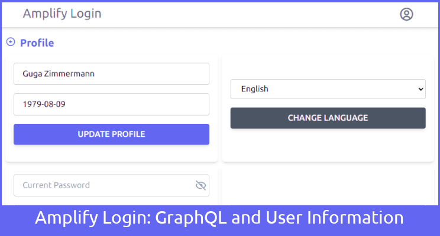
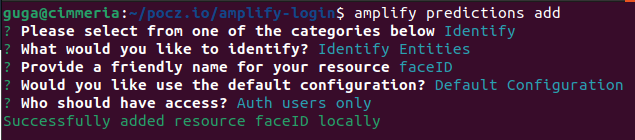
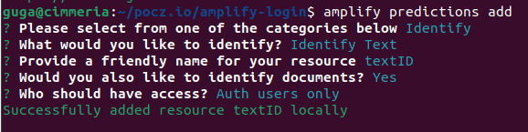
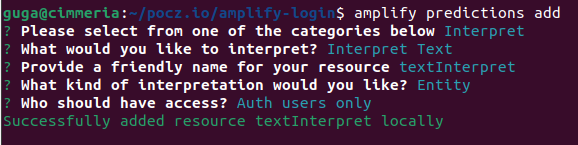
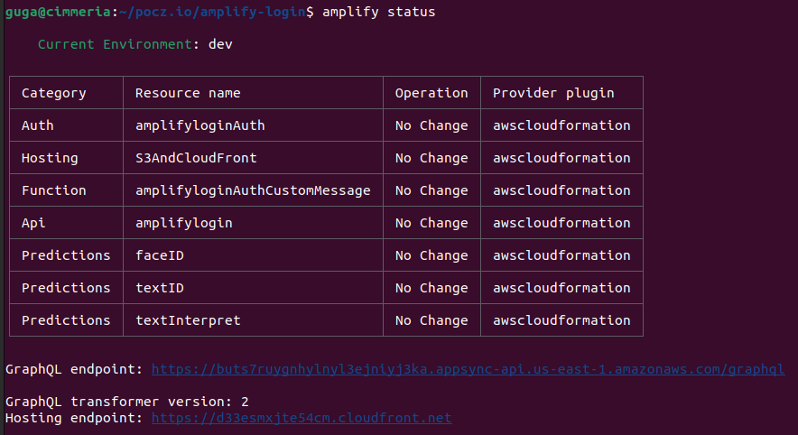
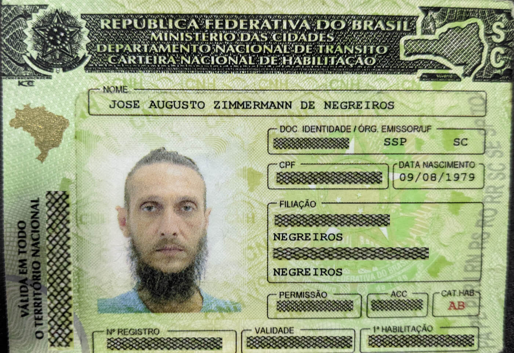

# Complete Login Flow using React, AWS Amplify (Auth with Cognito / GraphQL with DynamoDB / Hosting with S3 and CloudFront) / Liveliness Check, Document Check and Face Comparison using AWS Amplify Predictions (with Rekognition and Comprehend)



Running version: <https://amplifylogintutorial.pocz.io/>

## Part 1

Here: <https://www.linkedin.com/pulse/complete-login-flow-using-react-aws-amplify-auth-s3-jos%C3%A9-augusto/>

or here: <https://medium.com/@gugazimmermann/complete-login-flow-using-react-aws-amplify-auth-with-cognito-graphql-with-dynamodb-hosting-d0f10718e217>

Code: <https://github.com/gugazimmermann/amplify-login/tree/part-1>

## Part 2

Here: <https://www.linkedin.com/pulse/part-2-login-react-aws-amplify-cognito-multi-language-jos%C3%A9-augusto/>

or here: <https://medium.com/@gugazimmermann/part-2-complete-login-flow-using-react-aws-amplify-auth-with-cognito-graphql-with-dynamodb-aa3f47c09157>

Code: <https://github.com/gugazimmermann/amplify-login/tree/part-2>

## Part 3

Here: <https://www.linkedin.com/pulse/part-3-complete-login-flow-using-react-aws-amplify-s3-jos%C3%A9-augusto/>

or here: <https://medium.com/@gugazimmermann/part-3-complete-login-flow-using-react-aws-amplify-auth-with-cognito-graphql-with-dynamodb-f48b614b99dd>

Code: <https://github.com/gugazimmermann/amplify-login/tree/part-3>

## KYC - Know Your Customer

[](http://www.youtube.com/watch?v=F0YuYd9pUs4)

Code: <https://github.com/gugazimmermann/amplify-login/tree/v1.9>

Until now we have create a React App with a full login system, multi language capability, and are able to change the user Profile.

We are using AWS Amplify with Auth (Cognito / Custom Message with Lambda), GraphQL API (DynamoDB / AppSync), and Hosting (S3 / CloudFront / Route 53).

In this part of the tutorial we will perform a Liveliness Check, using the user camera and ask for random gesture to see if it is a live stream, after that we will compare the user name and date of birth with some document with photo, like a Passport or a Driver License, and to finish compare the photo of the document to a snapshot taken of the user liveliness check.

This part is a modified and updated version of the AWS Workshop: Self Service KYC Workshop using Amplify and AI Services.

## Home Tabs

First, let’s fix some parts of the code from the previous parts.

`src/pages/Layout/Layout.jsx`

```JS
...
  return (
    <main className="mx-auto max-w-screen-lg h-screen">
      {loading && <Loading />}
      <Nav handleSignOut={handleSignOut} />
      <div className="h-full -mt-12 pt-12">
        <Outlet context={{ loadUser, setLoading }} />
      </div>
    </main>
  );
...
```

`src/pages/Profile/Profile.jsx`

```JS
...
<section className="p-4">
...
```

`src/pages/Profile/ProfileAttributes.jsx`

```JS
...
setBithdate(user?.birthdate ? FormatDate.Show(user?.birthdate, user.locale) : "");
...
const birthdateFormated = user.locale === "pt-BR" ? moment(birthdate, "DD/MM/YYYY").format("YYYY-MM-DD") : moment(birthdate, "YYYY-MM-DD").format("YYYY-MM-DD");
...
```

`src/components/Alert.jsx`

```JS
...
? "bg-amber-500 text-white font-bold border border-amber-600 py-2 rounded-md shadow-md"
...
```

OK, now we will need 4 screens in this app, first just a Welcome, than the Liveliness Check, the Upload Documents and the Summary Details, let’s start:

Home will have 4 tabs, but the user will not be able to navigate free from tab to tab, need to follow the sequence of validations.

And I Home we will also handle the Rekognition and Comprehend Client, using the AWS SDK v3.

Now we will need do add some packages to make everything work:

`npm install @aws-sdk/client-rekognition @aws-sdk/client-comprehend`.

To initialize Rekognition and Comprehend we will need the Cognito Credentials, so let's change `src/api/auth.js` to be able to use it.

```JS
...
const GetCredentials = async () => {
  const credentials = await AmplifyAuth.currentCredentials();
  return credentials;
}

const Auth = {
  SignUp,
  ResendConfirmationCode,
  ConfirmSignUp,
  SignIn,
  ForgotPassword,
  RedefinePassword,
  GetUser,
  SignOut,
  ChangeEmail,
  ConfirmChangeEmail,
  ChangePassword,
  ChangeLanguage,
  GetCredentials
};

export default Auth;

```

And finally the Home Screen.

`src/pages/home/Home.jsx`

```JS
import { useCallback, useContext, useEffect, useState } from "react";
import { RekognitionClient } from "@aws-sdk/client-rekognition";
import { ComprehendClient } from "@aws-sdk/client-comprehend";
import awsConfig from "../../aws-exports";
import Auth from "../../api/auth";
import { AppContext } from "../../context";
import { Alert } from "../../components";
import Welcome from "../welcome/Welcome";
import LivelinessCheck from "../liveliness-check/LivelinessCheck";
import UploadDocuments from "../upload-documents/UploadDocuments";
import SummaryDetails from "../summary-details/SummaryDetails";
import { LANGUAGES } from "../../constants";

export default function Home() {
  const { state } = useContext(AppContext);
  const { user } = state;
  const [rekognitionClient, setRekognitionClient] = useState();
  const [comprehendClient, setComprehendClient] = useState();
  const [userData, setUserData] = useState();
  const [image1, setImage1] = useState();
  const [image2, setImage2] = useState();
  const [tab, setTab] = useState(1);
  const [tabs, setTabs] = useState([
    { name: LANGUAGES[user.locale].KYC.Welcome.Button, number: 1, done: false },
    {
      name: LANGUAGES[user.locale].KYC.Liveliness.Button,
      number: 2,
      done: true,
    },
    {
      name: LANGUAGES[user.locale].KYC.Documents.Button,
      number: 3,
      done: true,
    },
    { name: LANGUAGES[user.locale].KYC.Summary.Button, number: 4, done: true },
  ]);

  const configClients = useCallback(async () => {
    const authCredentials = await Auth.GetCredentials();
    const client = new RekognitionClient({
      region: awsConfig.aws_cognito_region,
      credentials: authCredentials,
    });
    setRekognitionClient(client);
    const compClient = new ComprehendClient({
      region: awsConfig.aws_cognito_region,
      credentials: authCredentials,
    });
    setComprehendClient(compClient);
  }, []);

  useEffect(() => {
    configClients();
  }, [configClients]);

  const renderTabButton = (t) => (
    <button
      key={t.number}
      type="button"
      onClick={() => setTab(t.number)}
      disabled={t.done}
      className={`p-4 w-full rounded-t-md sm:rounded-b-md sm:rounded-t-none ${
        tab === t.number && "bg-indigo-500 text-white font-bold"
      }`}
    >
      {t.name}
    </button>
  );

  const renderTabsButtons = () => (
    <footer className="order-2 sm:order-1 flex flex-row text-sm">
      {tabs.map((t) => renderTabButton(t))}
    </footer>
  );

  const handleSetTab = (actual, next) => {
    const t = tabs.map((x) => x);
    t.forEach((x) => {
      if (x.number === actual) x.done = true;
      if (x.number === next) x.done = false;
    });
    setTabs(t);
    setTab(next);
  };

  return (
    <section className="h-full flex flex-col justify-between sm:justify-start">
      <div className="order-1 sm:order-2 px-8">
        {(!user.name || !user.birthdate) && (
          <Alert
            type="warning"
            text={LANGUAGES[user.locale].Home.CompleteProfile}
          />
        )}
        {tab === 1 && <Welcome handleSetTab={handleSetTab} />}
        {tab === 2 && (
          <LivelinessCheck
            rekognition={rekognitionClient}
            handleSetTab={handleSetTab}
            handleSetImage={setImage1}
          />
        )}
        {tab === 3 && (
          <UploadDocuments
            rekognition={rekognitionClient}
            comprehend={comprehendClient}
            handleSetTab={handleSetTab}
            handleUserData={setUserData}
            handleSetImage={setImage2}
          />
        )}
        {tab === 4 && (
          <SummaryDetails
            rekognition={rekognitionClient}
            handleSetTab={handleSetTab}
            userData={userData}
            image1={image1}
            image2={image2}
          />
        )}
      </div>
      {renderTabsButtons()}
    </section>
  );
}
```

Welcome will be the first tab, just a screen telling the user what we will do.

`src/pages/welcome/Welcome.jsx`

```JS
import { useContext } from "react";
import { Button, Title } from "../../components";
import { LANGUAGES } from "../../constants";
import { AppContext } from "../../context";

export default function Welcome({handleSetTab}) {
  const { state } = useContext(AppContext);

  return (
    <>
      <div className="mt-4 text-center">
        <Title text={LANGUAGES[state.user.locale].KYC.Welcome.Title} size="text-2xl" />
      </div>
      <p className="my-4 font-bold">
        {LANGUAGES[state.user.locale].KYC.Welcome.SubTitle}
      </p>
      <ul className="list-disc text-justify">
        <li className="mt-4">{LANGUAGES[state.user.locale].KYC.Welcome.DescriptionOne}</li>
        <li className="mt-4">{LANGUAGES[state.user.locale].KYC.Welcome.DescriptionTwo}</li>
        <li className="mt-4">{LANGUAGES[state.user.locale].KYC.Welcome.DescriptionThree}</li>
      </ul>
      <div className="w-full flex justify-center mt-8">
        <Button
          text={LANGUAGES[state.user.locale].KYC.Welcome.Start}
          handler={() => handleSetTab(1, 2)}
        >
        </Button>
      </div>
    </>
  );
}
```

## Adding Amplify Predictions and Liveliness Checks with AWS Rekognition

Code: <https://github.com/gugazimmermann/amplify-login/tree/v2.0>

We will now start adding the core features for self-service KYC. The first step is to add a Liveliness check. This involves asking the user to perform random poses and checking if they match the request. Capturing a snapshot of the user and checking for the pose with AWS Rekognition, for this purpose, we will invoke Rekognition API to check for a face and characteristics such as orientation, smile, eyes-closed, open mouth, etc.

Run `amplify predictions add` and select Identify > Identify Entities > faceID, Default Configuration and Auth Users Only.



Now run `amplify push -y` to send to the cloud.

We can start to work in the Liveliness Check, first we will need to create a JSON file with the gestures we want, and create the descriptions in the languages that we use in the app.

In the Liveliness check we will ask the user to perform 3 "random" gestures. (not so random, because the first will always be the smile).

`pages/liveliness-check/gestures.json`

```JSON
[
  {
    "name": "smile",
    "description": {
      "en-US": "Please smile.",
      "pt-BR": "Por favor, sorria."
    }
  },
  {
    "name": "lookRight",
    "description": {
      "en-US": "Please turn your face to your right.",
      "pt-BR": "Por favor, gire seu rosto para a direita"
    }
  },
  {
    "name": "lookLeft",
    "description": {
      "en-US": "Please turn your face to your left.",
      "pt-BR": "Por favor, gire seu rosto para a esquerda"
    }
  },
  {
    "name": "mouthOpen",
    "description": {
      "en-US": "Please open your mouth.",
      "pt-BR": "Por favor, abra sua boca."
    }
  },
  {
    "name": "eyesClose",
    "description": {
      "en-US": "Please close your eyes.",
      "pt-BR": "Por favor, feche seus olhos."
    }
  }
]
```

And again let's install other packages needed.

`npm install react-webcam buffer`

Two new components will be useful in this screen, a Spinner to act as a loading and a Progress bar to keep the user informed about the steps.

`src/components/Spinner.jsx`

```JS
const Spinner = ({ className, color }) => (
  <p className={className}>
    <i
      className={`bx bx-loader-circle text-5xl font-bold animate-ping ${
        color ? color : "text-indigo-800"
      }`}
    />
  </p>
);

export default Spinner;
```

`src/components/ProgressBar.jsx`

```JS
const ProgressBar = ({ value }) => (
  <div className="relative w-full bg-gray-200 h-10">
    <p className="absolute top-1/2 left-1/2 transform -translate-x-1/2 -translate-y-1/2">{`${value}%`}</p>
    <div
      className=" bg-amber-500 h-10 flex justify-center items-center"
      style={{ width: `${value}%` }}
    />
  </div>
);

export default ProgressBar;
```

Very simple components, but works for what we need, and add to the exports index `src/components/index.js`

```JS
...
export { default as ProgressBar } from "./ProgressBar";
export { default as Spinner } from "./Spinner";
...
```

And finally the Liveliness check page:

`src/pages/liveliness-check/LivelinessCheck.jsx`

```JS
import { useState, useEffect, useRef, useContext } from "react";
import Webcam from "react-webcam";
import { Buffer } from "buffer";
import { DetectFacesCommand } from "@aws-sdk/client-rekognition";
import { Title, Button, ProgressBar, Spinner } from "../../components";
import { AppContext } from "../../context";
import { LANGUAGES } from "../../constants";
import gesturesJson from "./gestures.json";

const videoConstraintsProps = {
  width: 1280,
  height: 720,
  facingMode: "user",
};

const screenShotProps = {
  width: 800,
  height: 450,
};

export default function LivelinessCheck({ rekognition, handleSetTab, handleSetImage }) {
  const { state } = useContext(AppContext);
  const webcamRef = useRef(null);
  const [gestures, setGestures] = useState(null);
  const [gesture, setGesture] = useState(null);
  const [loading, setLoading] = useState(false);
  const [alertMessage, setAlertMessage] = useState(
    LANGUAGES[state.user.locale].KYC.Liveliness.SubTitle
  );
  const [errorMessage, setErrorMessage] = useState();
  const [showProgress, setShowProgress] = useState(false);
  const [showWebcam, setShowWebcam] = useState(false);
  const [progressValue, setProgressValue] = useState(0);

  useEffect(() => {
    const g = [];
    g.push(gesturesJson[0]);
    gesturesJson.shift();
    gesturesJson.sort(() => Math.random() - 0.5);
    setGestures(g.concat(gesturesJson.slice(0, 2)));
  }, []);

  useEffect(() => {
    if (gesture !== null) {
      const description = gestures.find((g) => g.name === gesture).description[
        state.user.locale
      ];
      setAlertMessage(description);
    }
  }, [gesture]);

  const updateGestureState = () => {
    const g = gestures.map((x) => x);
    g.shift();
    setGestures(g);
    if (g.length === 2) {
      setProgressValue(33);
      setGesture(g[0].name);
    } else if (g.length === 1) {
      setProgressValue(66);
      setGesture(g[0].name);
    } else {
      setProgressValue(100);
      setShowWebcam(false);
      gesturesJson.sort(() => Math.random() - 0.5);
      setGestures(gesturesJson.slice(0, 3));
    }
  };

  const validateGesture = (gesture, data) => {
    const failedValidate = {
      result: false,
      message: LANGUAGES[state.user.locale].KYC.Liveliness.FailedValidate,
    };
    if (!data.FaceDetails.length) {
      return {
        result: false,
        message: LANGUAGES[state.user.locale].KYC.Liveliness.NoFace,
      };
    }
    if (data.length > 1) {
      return {
        result: false,
        message: LANGUAGES[state.user.locale].KYC.Liveliness.MoreThanOneFace,
      };
    }
    if (gesture === "smile") {
      if (data.FaceDetails[0]?.Smile?.Value === true) {
        return {
          result: true,
          message: LANGUAGES[state.user.locale].KYC.Liveliness.ThankYou,
        };
      } else {
        return failedValidate;
      }
    } else if (gesture === "lookRight") {
      if (data.FaceDetails[0]?.Pose?.Yaw <= -30) {
        return {
          result: true,
          message: LANGUAGES[state.user.locale].KYC.Liveliness.ThankYou,
        };
      } else {
        return failedValidate;
      }
    } else if (gesture === "lookLeft") {
      if (data.FaceDetails[0]?.Pose?.Yaw >= 30) {
        return {
          result: true,
          message: LANGUAGES[state.user.locale].KYC.Liveliness.ThankYou,
        };
      } else {
        return failedValidate;
      }
    } else if (gesture === "mouthOpen") {
      if (data.FaceDetails[0]?.MouthOpen?.Value === true) {
        return {
          result: true,
          message: LANGUAGES[state.user.locale].KYC.Liveliness.ThankYou,
        };
      } else {
        return failedValidate;
      }
    } else if (gesture === "eyesClose") {
      if (data.FaceDetails[0]?.EyesOpen?.Value === false) {
        return {
          result: true,
          message: LANGUAGES[state.user.locale].KYC.Liveliness.ThankYou,
        };
      } else {
        return failedValidate;
      }
    }
    return {
      result: false,
      message: LANGUAGES[state.user.locale].KYC.Liveliness.Unkown,
    };
  };

  const requestGesture = async () => {
    setLoading(true);
    const imgBase64Strg = webcamRef.current.getScreenshot(screenShotProps);
    const buffer = new Buffer.from(
      imgBase64Strg.split(";base64,").pop(),
      "base64"
    );
    const detectFaces = await rekognition.send(
      new DetectFacesCommand({
        Attributes: ["ALL"],
        Image: { Bytes: buffer },
      })
    );
    if (detectFaces?.$response?.error) {
      setLoading(false);
      setErrorMessage(detectFaces.$response.error.message);
    } else {
      let res = validateGesture(gesture, detectFaces);
      if (res.result) {
        if (gesture === 'smile' && handleSetImage) handleSetImage(imgBase64Strg)
        setErrorMessage();
        setAlertMessage(res.message);
        setLoading(false);
        updateGestureState();
      } else {
        setErrorMessage(res.message);
        setLoading(false);
      }
    }
  };

  function startLiveliness() {
    setShowProgress(true);
    setShowWebcam(true);
    setGesture(gestures[0].name);
  }

  return (
    <>
      <div className="mt-4 flex flex-col items-center">
        <Title
          text={LANGUAGES[state.user.locale].KYC.Liveliness.Title}
          size="text-2xl"
        />
        <Title text={alertMessage} color="text-black" />
        <Title text={errorMessage} color="text-red-500" />
        {!showProgress && (
          <div className="w-2/12 text-center">
            <Button text="Start" handler={() => startLiveliness()} />
          </div>
        )}
        <div className="mt-4">
          {showWebcam && (
            <div className="relative">
              <Webcam
                ref={webcamRef}
                height={450}
                width={800}
                videoConstraints={videoConstraintsProps}
                screenshotFormat="image/jpeg"
                audio={false}
              />
              {loading && (
                <Spinner className="absolute top-1/2 left-1/2 transform -translate-x-1/2 -translate-y-1/2" />
              )}
            </div>
          )}
          {showProgress && progressValue < 100 && (
            <>
              <ProgressBar value={progressValue} />
              <Button
                text={LANGUAGES[state.user.locale].KYC.Liveliness.Validate}
                handler={() => requestGesture()}
                full
              />
            </>
          )}
          {progressValue === 100 && (
            <Button
              text={LANGUAGES[state.user.locale].KYC.Liveliness.Continue}
              handler={() => handleSetTab(2, 3)}
            />
          )}
        </div>
      </div>
    </>
  );
}
```

This page will load the gestures, choose 3 and ask the user to do it in front of the camera. In the Smile gesture we will store the snapshot to be used in the final screen.

## Add Document Checks with AWS Comprehend

Code: <https://github.com/gugazimmermann/amplify-login/tree/v2.1>

For this next screen we will add document check in our app to verify photo IDs. Here we use Amazon Rekognition to detect text in the photo ids and then use Amazon Comprehend to discover entities in the resulting text like name, date of birth, gender, etc. We also use Rekognition to detect the face in the photo id. This will enable us to later compare the face with a snapshot we can capture in the previous step.

We have already enabled Predictions for face detection for Liveliness checks. We can continue to use that for detecting photo in the id. But we now need to detect text as well and entities in text. For this we need to enable new features in Predictions.

Run `amplify predictions add`, Select Identify, Identify Text, put textID as resource name, select Yes for Identify Documents, and add access to auth users only.



Run `amplify predictions add` again, select Interpret, Interpret Text, put textInterpret in the resource name, select Entity and add access to auth users only.



To enable detectLabels, we need to do the following: Open `amplify/backend/predictions/faceID/faceID-template.json` find PolicyDocument and add "rekognition:DetectLabels".

```JSON
...
"PolicyDocument": {
  "Version": "2012-10-17",
  "Statement": [
    {
      "Effect": "Allow",
      "Action": [
        "rekognition:DetectFaces",
        "rekognition:RecognizeCelebrities",
        "rekognition:DetectLabels"
      ],
      "Resource": "*"
    }
  ]
}
...
```

Run `amplify push -y` to update and create the resources in the AWS Cloud.
And if you run `amplify status` you will see something like this:



Now the frontend for the Document check feature to capture the photo id of the user. For this we add a new Upload page to our react app.

In this page the user will be asked to show a document with the Name, Date of Birth and Photo. This can be done using the camera (but in webcams it will probably fail, in phones will work better because the camera quality and focus), or uploading the doc.

But before we need a extra package, slugify... we need it because in some documents the name can contain or not accents, and since we are using Portuguese as one the languages, many names have accents, like mine, José Augusto.

So run `npm install slugify`.

In this tutorial I’ll focus in just one document, the Drive License (Brazil and USA). Here we will have Photo, name and Data of Birth. But we can easily upgrade the code to work with Passport or any other document.

In part 3 of the tutorials we asked the user to submit the name and the date of birth, so this need to match.

|  |  |
| ------------------------------------------- | ------------------------------------------- |

Before start this part of the code, let’s fix the Button component:

`src/components/Button.jsx`

```JS
const AuthButton = ({ text, disabled, handler, full }) => (
  <button
    type="button"
    onClick={handler}
    disabled={disabled}
    className={`${
      disabled
        ? "bg-gray-600 cursor-not-allowed"
        : "bg-indigo-500 cursor-pointer hover:bg-amber-500 hover:shadow-md focus:bg-amber-500 focus:shadow-md focus:outline-none focus:ring-0 active:bg-amber-500 active:shadow-md"
    } px-4 py-1.5 text-white font-medium uppercase rounded shadow-md transition duration-150 ease-in-out ${full && 'inline-block w-full'}`}
  >
    {text}
  </button>
);

export default AuthButton;
```

Now the button can receive a full property when we need a full width button, or leave it blank when we want a normal button. But Button component is used in a lot of places:

`src/pages/auth/ConfirmSignUp.jsx`, `src/pages/auth/ForgotPassword.jsx`, `src/pages/auth/RedefinePassword.jsx`, `src/pages/auth/SignIn.jsx`, `src/pages/auth/SignUp.jsx`, `src/pages/Profile/ProfileAttributes.jsx`, `src/pages/Profile/ProfileChangePassword.jsx`, `src/pages/Profile/ProfileEmail.jsx`, `src/pages/Profile/ProfileLanguage.jsx`, and every place need to be updated like this:

```JS
<Button
  text={LANGUAGES[state.lang].Auth.SignUpButton}
  disabled={disabled()}
  handler={() => signUp(email, pwd, repeat)}
  full
/>
```

When we take a photo of the document we already receive it in Base64, but when we upload a image not, so we need a helper to convert.

`src/helpers/convertBase64.js`

```JS
const ConvertBase64 = (file) => {
  return new Promise((resolve, reject) => {
    const fileReader = new FileReader();
    fileReader.readAsDataURL(file);
    fileReader.onload = () => resolve(fileReader.result);
    fileReader.onerror = (error) => reject(error);
  });
};

export default ConvertBase64;
```

And add in the exports index `src/helpers/index.js`

```JS
export { default as ConvertBase64 } from "./convertBase64";
```

And we are good to create the `src/pages/upload-documents`

```JS
import { useState, useRef, useContext } from "react";
import Webcam from "react-webcam";
import { Buffer } from "buffer";
import { DetectFacesCommand, DetectTextCommand } from "@aws-sdk/client-rekognition";
import { DetectEntitiesCommand } from "@aws-sdk/client-comprehend";
import { Title, Button, Spinner, ProgressBar } from "../../components";
import { AppContext } from "../../context";
import { LANGUAGES } from "../../constants";
import slugify from "slugify";
import moment from "moment";
import { ConvertBase64 } from "../../helpers";

const videoConstraintsProps = {
  width: 1280,
  height: 720,
  facingMode: "environment",
};

const screenShotProps = {
  width: 800,
  height: 450,
};

export default function UploadDocuments({ rekognition, comprehend, handleSetTab, handleUserData, handleSetImage }) {
  const { state } = useContext(AppContext);
  const webcamRef = useRef(null);
  const [alertMessage, setAlertMessage] = useState(
    LANGUAGES[state.user.locale].KYC.Documents.SubTitle
  );
  const [loading, setLoading] = useState(false);
  const [errorMessage, setErrorMessage] = useState();
  const [showProgress, setShowProgress] = useState(false);
  const [progressValue, setProgressValue] = useState(0);
  const [showWebcam, setShowWebcam] = useState(false);
  const [showUpload, setShowUpload] = useState(false);
  const [fileName, setFileName] = useState(
    LANGUAGES[state.user.locale].KYC.Documents.FileName
  );
  const [completed, setCompleted] = useState(false);

  const handleDocumentType = (words) => {
    let docType = null;
    if (words.find((x) => x.toLocaleLowerCase() === "passport")) {
      docType = LANGUAGES[state.user.locale].KYC.Documents.DocTypePassport;
    }
    if (
      words.find(
        (x) =>
          x.toLocaleLowerCase().includes("transito") ||
          x.toLocaleLowerCase().includes("driver")
      )
    ) {
      docType = LANGUAGES[state.user.locale].KYC.Documents.DocTypeDriver;
    }
    return docType;
  };

  const handleName = (personEntity) => {
    let findName = null;
    findName = personEntity.find((x) => {
      const t = x.Text.includes(", ") ? x.Text.split(", ")[1] : x.Text;
      return slugify(state.user.name, { lower: true }).startsWith(
        slugify(t, { lower: true })
      );
    });
    return findName?.Text || null;
  };

  const findBirthDate = (dobEntity) => {
    let findDob = null;
    findDob = dobEntity.find((x) => {
      const format =
        state.user.locale === "en-US" ? "MM/DD/YYYY" : "DD/MM/YYYY";
      return (
        (x.Text[2] === "/"
          ? moment(x.Text, format).format("YYYY-MM-DD")
          : x.Text) === state.user.birthdate
      );
    });
    return findDob?.Text || null;
  };

  const captureTextDetails = async (image) => {
    let resDocType = null;
    let resName = null;
    let resDoB = null;
    const txtResponse = await rekognition.send(
      new DetectTextCommand({
        Image: { Bytes: image },
        Filters: { WordFilter: { MinConfidence: 80 } },
      })
    );
    setProgressValue(50);
    if (txtResponse?.$response?.error || !txtResponse.TextDetections.length) {
      setLoading(false);
      setErrorMessage(
        txtResponse?.$response?.error?.message ||
          LANGUAGES[state.user.locale].KYC.Documents.NoText
      );
    } else {
      const detected = txtResponse.TextDetections.filter(
        (item) => item.Type === "WORD" && item.Confidence > 95
      );
      const detectedMap = detected.map((item) => item.DetectedText);
      resDocType = handleDocumentType(detectedMap);
      let entitiesResponse = await comprehend.send(
        new DetectEntitiesCommand({
          Text: detectedMap.join(" "),
          LanguageCode: state.user.locale === "en-US" ? "en" : "pt",
        })
      );
      setProgressValue(75);
      if (
        entitiesResponse?.$response?.error ||
        !entitiesResponse.Entities.length
      ) {
        setLoading(false);
        setErrorMessage(
          entitiesResponse?.$response?.error?.message ||
            LANGUAGES[state.user.locale].KYC.Documents.NoEntities
        );
      } else {
        entitiesResponse.Entities.sort((a, b) => a.Score - b.Score);
        entitiesResponse.Entities.reverse();
        let entities = entitiesResponse.Entities.filter((e) => e.Score > 0.6);
        let personEntity = entities.filter((e) => e.Type === "PERSON");
        resName = handleName(personEntity);
        let dobEntity = entities.filter((e) => e.Type === "DATE");
        resDoB = findBirthDate(dobEntity);
      }
    }
    return { docType: resDocType, name: resName, dob: resDoB };
  };

  const captureFaceDetails = async (imageBuffer) => {
    let age = null;
    let sex = null;
    const faceDetectResponse = await rekognition.send(
      new DetectFacesCommand({
        Attributes: ["ALL"],
        Image: { Bytes: imageBuffer },
      })
    );
    setProgressValue(75);
    if (
      faceDetectResponse?.$response?.error ||
      !faceDetectResponse.FaceDetails.length
    ) {
      setLoading(false);
      setErrorMessage(
        faceDetectResponse?.$response?.error?.message ||
          LANGUAGES[state.user.locale].KYC.Documents.NoFace
      );
    } else {
      age = faceDetectResponse.FaceDetails[0].AgeRange;
      sex = faceDetectResponse.FaceDetails[0].Gender.Value;
    }
    return { age, sex };
  };

  const handleProcess = async (imgBase64Strg) => {
    handleSetImage(imgBase64Strg)
    const base64Img = imgBase64Strg.split(";base64,").pop();
    const binaryImg = new Buffer.from(base64Img, "base64");
    setProgressValue(25);
    const { docType, name, dob } = await captureTextDetails(binaryImg);
    const { age, sex } = await captureFaceDetails(binaryImg);
    handleUserData({
      documentType: docType,
      username: name,
      birthdate: dob,
      ageRange: age,
      gender: sex,
    })
    setProgressValue(100);
    setLoading(false);
    if (name && dob) {
      setErrorMessage(null);
      setAlertMessage(LANGUAGES[state.user.locale].KYC.Documents.Success);
      setCompleted(true);
    } else {
      setErrorMessage(LANGUAGES[state.user.locale].KYC.Documents.Fail);
      setCompleted(false);
    }
    setShowWebcam(false);
    setShowUpload(false);
    setShowProgress(false);
  };

  const handleCapture = () => {
    setErrorMessage(null);
    setLoading(true);
    setShowProgress(true);
    setProgressValue(5);
    const imgBase64Strg = webcamRef.current.getScreenshot(screenShotProps);
    handleProcess(imgBase64Strg);
  };

  async function handleFile(e) {
    setErrorMessage(null);
    setLoading(true);
    setShowProgress(true);
    setProgressValue(5);
    const f = e.target.files[0];
    setFileName(f.name);
    const imgBase64Strg = await ConvertBase64(f);
    handleProcess(imgBase64Strg);
  }

  function startCameraTest() {
    setProgressValue(0);
    setShowWebcam(true);
    setShowUpload(false);
    setAlertMessage(LANGUAGES[state.user.locale].KYC.Documents.ShowDocument);
  }

  function startUploadTest() {
    setProgressValue(0);
    setShowWebcam(false);
    setShowUpload(true);
    setAlertMessage(LANGUAGES[state.user.locale].KYC.Documents.UploadDocument);
  }

  const renderButtons = () => (
    <div className="w-6/12 flex flex-row justify-around">
      <Button
        text={LANGUAGES[state.user.locale].KYC.Documents.Camera}
        handler={() => {
          setShowUpload(false);
          setShowWebcam(true);
          startCameraTest();
        }}
      />
      <Button
        text={LANGUAGES[state.user.locale].KYC.Documents.Upload}
        handler={() => {
          setShowUpload(true);
          setShowWebcam(false);
          startUploadTest();
        }}
      />
    </div>
  );

  const renderWebCam = () => (
    <Webcam
      ref={webcamRef}
      height={450}
      width={800}
      videoConstraints={videoConstraintsProps}
      screenshotFormat="image/jpeg"
      audio={false}
    />
  );

  const renderFileUpload = () => (
    <>
      <input
        type="file"
        id="files"
        className="hidden"
        onChange={(e) => handleFile(e)}
        accept=".jpg,.jpeg,.png,image/png,image/jpeg"
        disabled={progressValue > 0}
      />

      <label
        htmlFor="files"
        className="relative file:hidden bg-white block w-full px-4 py-2 border border-solid border-gray-300 rounded transition ease-in-out m-0 focus:border-primary focus:outline-none"
      >
        <i className="bx bx-file-find text-2xl absolute top-1 right-1" />
        {fileName}
      </label>
    </>
  );

  return (
    <>
      <div className="mt-4 flex flex-col items-center">
        <Title
          text={LANGUAGES[state.user.locale].KYC.Documents.Title}
          size="text-2xl"
        />
        <Title text={alertMessage} color="text-black" />
        <Title text={errorMessage} color="text-red-500" />
        {!showWebcam &&
          !showUpload &&
          !completed &&
          progressValue < 100 &&
          renderButtons()}
        <div className="relative w-full">
          {showWebcam && !showUpload && renderWebCam()}
          {!showWebcam && showUpload && renderFileUpload()}
          {loading && (
            <Spinner className="absolute top-1/2 left-1/2 transform -translate-x-1/2 -translate-y-1/2" />
          )}
        </div>
        {showProgress && progressValue < 100 && (
          <ProgressBar value={progressValue} />
        )}
        {showWebcam && !showProgress && (
          <Button
            text={LANGUAGES[state.user.locale].KYC.Documents.Validate}
            handler={() => handleCapture()}
            full
          />
        )}
        {progressValue === 100 && completed && (
          <Button
            text={LANGUAGES[state.user.locale].KYC.Documents.Continue}
            handler={() => handleSetTab(3, 4)}
          />
        )}
      </div>
    </>
  );
}
```

## Summary and Comparing Faces

Code: <https://github.com/gugazimmermann/amplify-login/tree/v2.2>

During Step 1, when the user do the Liveliness check we take a snapshot of the user face, and during the Step 2, the document validation, we can also see the user face from the document… now we can compare both.

To do it we need to change `amplify/backend/predictions/faceID/faceID-template.json`, search for `PolicyDocument` and add `rekognition:CompareFaces`;

```JSON
"PolicyDocument": {
  "Version": "2012-10-17",
  "Statement": [
    {
      "Effect": "Allow",
      "Action": [
        "rekognition:DetectFaces",
        "rekognition:RecognizeCelebrities",
        "rekognition:DetectLabels",
        "rekognition:CompareFaces"
      ],
      "Resource": "*"
    }
  ]
}
```

now run `amplify push -y`.

`src/pages/summary-details/SummaryDetails.jsx`

```JS
import { useCallback, useContext, useEffect, useState } from "react";
import { Buffer } from "buffer";
import { CompareFacesCommand } from "@aws-sdk/client-rekognition";
import { Title, Spinner } from "../../components";
import { LANGUAGES } from "../../constants";
import { AppContext } from "../../context";

export default function SummaryDetails({
  rekognition,
  handleSetTab,
  userData,
  image1,
  image2,
}) {
  const { state } = useContext(AppContext);
  const [loading, setLoading] = useState(false);
  const [alertMessage, setAlertMessage] = useState();
  const [errorMessage, setErrorMessage] = useState();
  const [faceSimilarity, setFaceSimilarity] = useState(-1);

  const compareFaces = useCallback(async () => {
    setLoading(true);
    const sourceBinaryImg = new Buffer.from(
      image1.split(";base64,").pop(),
      "base64"
    );
    const targetBinaryImg = new Buffer.from(
      image2.split(";base64,").pop(),
      "base64"
    );
    const compareFaces = await rekognition.send(
      new CompareFacesCommand({
        SourceImage: { Bytes: sourceBinaryImg },
        TargetImage: { Bytes: targetBinaryImg },
        QualityFilter: "NONE",
        SimilarityThreshold: 30,
      })
    );
    if (compareFaces.FaceMatches.length === 0) {
      setErrorMessage("Did not pass Face similarity test. Try again!");
      setFaceSimilarity(0);
    }
    setFaceSimilarity(compareFaces.FaceMatches[0].Similarity);
    if (compareFaces.FaceMatches[0].Similarity > 80) {
      setAlertMessage(" You have successfully completed the KYC");
    } else {
      setErrorMessage("Did not pass Face similarity test. Try again !");
    }
    setLoading(false);
  }, [image1, image2, rekognition]);

  useEffect(() => {
    compareFaces();
  }, [compareFaces]);

  return (
    <>
      <div className="mt-4 text-center">
        {loading && (
          <Spinner className="absolute top-1/2 left-1/2 transform -translate-x-1/2 -translate-y-1/2" />
        )}
        <Title
          text={LANGUAGES[state.user.locale].KYC.Summary.Title}
          size="text-2xl"
        />
        <Title text={alertMessage} color="text-black" />
        <Title text={errorMessage} color="text-red-500" />
        <pre>{JSON.stringify(userData, undefined, 2)}</pre>
        <pre>{`Face similarity: ${faceSimilarity}`}</pre>
      </div>
    </>
  );
}
```

This page will show to the user some information and also compare the face of the snapshot and the document, to show the similarity.

And that's it, we have a multi-language app with login, user profile, liveliness check, document check and face similarity.

I just forgot to tell about the translations, but you can see it here: <https://github.com/gugazimmermann/amplify-login/tree/part-4/src/constants/languages>

---

You can see the final code here: <https://github.com/gugazimmermann/amplify-login>

and try the App here: <https://amplifylogintutorial.pocz.io/>

And you can add me on LinkedIn <https://www.linkedin.com/in/guga-zimmermann/>
