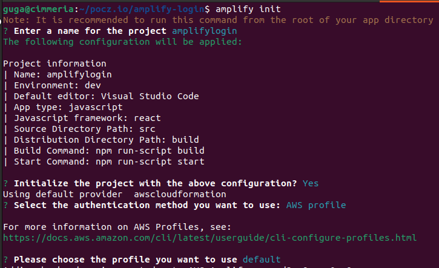
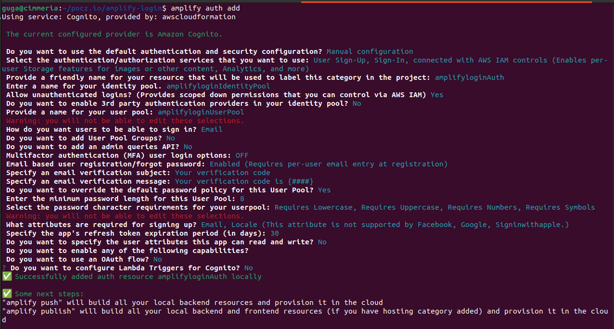
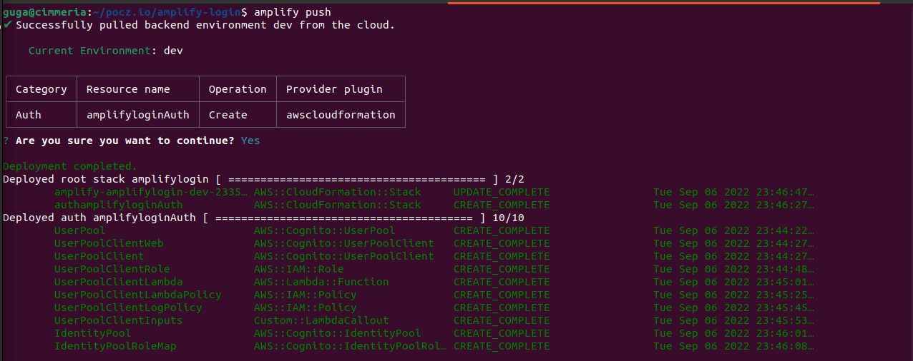
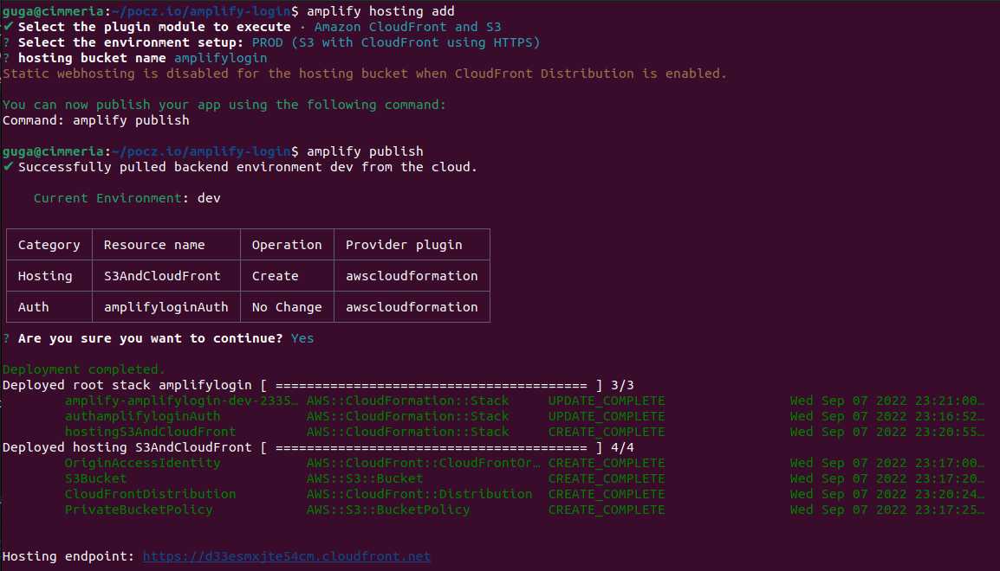

# Complete Login Flow using React, AWS Amplify (Auth with Cognito / GraphQL with DynamoDB / Hosting with S3 and CloudFront)

Running version: <https://amplifylogintutorial.pocz.io/>

## React and Tailwind

Code: <https://github.com/gugazimmermann/amplify-login/tree/v0.1>

As Front-End to this app we will use React and Tailwind, and will responsive and designed to small devices first. You can see more about React and Tailwind here:

* <https://create-react-app.dev/docs/getting-started>

* <https://tailwindcss.com/docs/guides/create-react-app>

This first part is pretty straight forward, choose the folder that you want the project and type `npx create-react-app amplify-login`.

Enter the amplify-login folder, and install tailwind dependencies `npm install -D tailwindcss postcss autoprefixer` and init tailwind `npx tailwindcss init -p`.

Now open `tailwind.config.js` and change content to

```JS
  content: [
    "./src/**/*.{js,jsx,ts,tsx}",
  ],
```

Remove all the content inside `src/index.css` and add the tailwind base, components and utilities:

```CSS
@tailwind base;
@tailwind components;
@tailwind utilities;
```

Delete `src/logo.svg` and `src/App.css`, we will not use it anymore. Open `src/App.js`, delete all content and paste:

```JS
function App() {
  return <h1 className="text-3xl font-bold underline">Hello world!</h1>;
}

export default App;

```

Now run `npm start` to see the Hello world!

## React Router v6

Code: <https://github.com/gugazimmermann/amplify-login/tree/v0.2>

To navigate the pages we will need React Router, you can see more about it here: <https://reactrouter.com/en/main>

Run `npm install react-router-dom@6` to install the package, open `src/index.js` and add
`import { BrowserRouter } from "react-router-dom";` after `import ReactDOM from 'react-dom/client';`. Inside the render part, add:

```JS
<React.StrictMode>
  <BrowserRouter>
    <App />
  </BrowserRouter>
</React.StrictMode>
```

Now create two initial pages and a loading component. Since we will use Lazy Loading is good have a loading for the Suspense.

Create `src/components/loading.jsx` with a loading text and a spinning icon:

```JS
const Loading = () => (
  <div className="fixed inset-0 bg-gray-900 bg-opacity-90 overflow-y-auto h-full w-full z-50">
    <div className="flex flex-col justify-center items-center h-full w-full">
      <div className="mb-4 text-primary text-2xl font-bold">Loading...</div>
      <div className="animate-spin rounded-full h-32 w-32 border-b-8 border-primary" />
    </div>
  </div>
);

export default Loading;

```

Create a Not Found page, just in case the user get lost.

`src/pages/not-found/NotFound.jsx`

```JS
const NotFound = () => (
  <div className="container bg-white mx-auto">
    <main className="flex h-screen justify-center items-center">
      <h1 className="text-3xl text-primary">404! Page Not Found!</h1>
    </main>
  </div>
);

export default NotFound;

```

and a initial layout for the authentication forms

`src/pages/auth/AuthLayout.jsx`

```JS
export default function AuthLayout() {
  return (
    <section className="h-screen mx-auto bg-white">
      <div className="container h-full fixed">
        <div className="h-full flex flex-col-reverse md:flex-row items-center justify-center">
          LAYOUT
        </div>
      </div>
    </section>
  );
}

```

With this done, we can change `src/App.js` to handle the routes.

```JS
import { lazy, Suspense } from "react";
import { Routes, Route } from "react-router-dom";
import Loading from "./components/loading";

const NotFound = lazy(() => import("./pages/not-found/NotFound"));
const AuthLayout = lazy(() => import("./pages/auth/AuthLayout"));

function App() {
  return (
    <Suspense fallback={<Loading />}>
      <Routes>
        <Route path="/" element={<AuthLayout />} />
        <Route path="*" element={<NotFound />} />
      </Routes>
    </Suspense>
  );
}

export default App;

```

## Images and Auth pages templates

code: <https://github.com/gugazimmermann/amplify-login/tree/v0.3>

To give the page some life let’s add some images. First we will change the favicon, I’m using this one:


<https://www.flaticon.com/free-icon/programming_1005141?term=code&page=1&position=13&page=1&position=13&related_id=1005141&origin=tag>

And to create the favicon this page helps a lot: <https://favicon.io/favicon-converter/>

Just upload the icon image, click download, open the zip file and copy `favicon.ico`, `android-chrome-192x192.png`, `android-chrome-512x512.png` to  `public` folder. Rename both to `logo192.png` and `logo512.png`.

Open `public/index.html` and change `<title>React App</title>` to `<title>%REACT_APP_TITLE%</title>`. Create a `.env` file in the root of the app and paste `REACT_APP_TITLE=Amplify Login`.

Remember that every time that you change something inside the `.env` file you will need to stop the app and run again with `npm start`.

To have some images in the app, you can go to unDraw <https://undraw.co/search> and search for every part of the auth flow, like: sign in, sign up, forgot password, confirm sign up, redefine password and page not found. I have selected some and you can copy from here: <https://github.com/gugazimmermann/amplify-login/tree/v0.3/src/images>, put the images inside `src/images/`

Let’s change the Not Found page `src/pages/not-found/NotFound.jsx`:

```JS
import NotFoundImg from '../../images/not_found.svg';

const NotFound = () => (
  <div className="container bg-white mx-auto">
    <main className="flex flex-col h-screen justify-center items-center">
      
      <h1 className='mt-4 text-xl'>Sorry, Page Not Found.</h1>
    </main>
  </div>
);

export default NotFound;

```

change the AuthLayout page `src/pages/auth/AuthLayout.jsx`:

```JS
import { useState } from "react";
import { Outlet } from "react-router-dom";

export default function AuthLayout() {
  const [img, setImg] = useState();

  return (
    <section className="h-screen mx-auto bg-white">
      <div className="container h-full fixed">
        <div className="h-full flex flex-col-reverse md:flex-row items-center justify-evenly">
          <div className="w-10/12 md:w-6/12 lg:w-4/12 md:mb-0">
            {img && }
          </div>
          <div className="w-10/12 md:w-5/12 lg:w-4/12">
            <Outlet context={{ setImg }}/>
          </div>
        </div>
      </div>
    </section>
  );
}

```

Now we are using the state to know what image to show, the Outlet from React Router v6 and passing the setImg in context to the Children pages.

Let’s create some templates to test:

`src/pages/auth/SignUp.jsx`

```JS
import { useEffect } from "react";
import { useOutletContext } from "react-router-dom";
import SignUpImage from "../../images/signup.svg";

export default function SignUp() {
  const { setImg } = useOutletContext();

  useEffect(() => {
    setImg(SignUpImage);
  }, [setImg]);

  return <form />;
}

```

`src/pages/auth/ConfirmSignUp.jsx`

```JS
import { useEffect } from "react";
import { useOutletContext } from "react-router-dom";
import ConfirmSignUpImage from "../../images/confirm_signup.svg";

export default function ConfirmSignUp() {
  const { setImg } = useOutletContext();

  useEffect(() => {
    setImg(ConfirmSignUpImage);
  }, [setImg]);

  return <form />;
}

```

`src/pages/auth/ForgotPassword.jsx`

```JS
import { useEffect } from "react";
import { useOutletContext } from "react-router-dom";
import ForgorPasswordImage from "../../images/forgor_password.svg";

export default function ForgorPassword() {
  const { setImg } = useOutletContext();

  useEffect(() => {
    setImg(ForgorPasswordImage);
  }, [setImg]);

  return <form />;
}

```

`src/pages/auth/RedefinePassword.jsx`

```JS
import { useEffect } from "react";
import { useOutletContext } from "react-router-dom";
import RedefinePasswordImage from "../../images/redefine_password.svg";

export default function RedefinePassword() {
  const { setImg } = useOutletContext();

  useEffect(() => {
    setImg(RedefinePasswordImage);
  }, [setImg]);

  return <form />;
}

```

and finally `/pages/auth/SignIn.jsx`, for this one we will create the form itself.

```JS
import { useEffect } from "react";
import { useOutletContext, Link } from "react-router-dom";
import SignInImage from "../../images/signin.svg";

export default function SignIn() {
  const { setImg } = useOutletContext();

  useEffect(() => {
    setImg(SignInImage);
  }, [setImg]);

  return (
    <form>
      <div className="mb-4">
        <input
          type="email"
          className="block w-full px-4 py-2 font-normal border border-solid border-gray-300 rounded transition ease-in-out m-0 focus:border-indigo-500 focus:outline-none"
          placeholder="Email"
        />
      </div>
      <div className="mb-4">
        <input
          type="password"
          className="block w-full px-4 py-2 font-normal border border-solid border-gray-300 rounded transition ease-in-out m-0 focus:border-indigo-500 focus:outline-none"
          placeholder="Password"
        />
      </div>
      <div className="flex justify-between items-center mb-4">
        <div className="form-group form-check">
          <input
            type="checkbox"
            name="checkbox"
            id="checkbox"
            className="form-check-input appearance-none h-4 w-4 border border-gray-300 rounded-sm bg-white checked:bg-indigo-500 checked:border-indigo-500 focus:outline-none transition duration-200 mt-1 align-top bg-no-repeat bg-center bg-contain float-left mr-2 cursor-pointer"
          />
          <label className="form-check-label inline-block" htmlFor="checkbox">
            Remember Me
          </label>
        </div>
        <Link
          to="/forgorpassword"
          className="text-indigo-500 hover:text-amber-500 duration-200 transition ease-in-out"
        >
          Forgot Password?
        </Link>
      </div>
      <button
        type="button"
        className="bg-indigo-500 cursor-pointer hover:bg-amber-500 hover:shadow-md focus:bg-amber-500 focus:shadow-md focus:outline-none focus:ring-0 active:bg-amber-500 active:shadow-md inline-block px-2 py-2 text-white font-medium uppercase rounded shadow-md transition duration-150 ease-in-out w-full"
      >
        Sign In
      </button>
      <div className="w-full text-center mt-6">
        <Link
          to="/signup"
          className="text-xl text-indigo-500 hover:text-amber-500 duration-200 transition ease-in-out"
        >
          Sign Up
        </Link>
      </div>
    </form>
  );
}

```

and now we need the routes to access the pages, open `src/App.js` and change to:

```JS
import { lazy, Suspense } from "react";
import { Routes, Route } from "react-router-dom";
import Loading from "./components/loading";

const NotFound = lazy(() => import("./pages/not-found/NotFound"));
const AuthLayout = lazy(() => import("./pages/auth/AuthLayout"));
const SignIn = lazy(() => import("./pages/auth/SignIn"));
const ForgotPassword = lazy(() => import("./pages/auth/ForgotPassword"));
const RedefinePassword = lazy(() => import("./pages/auth/RedefinePassword"));
const SignUp = lazy(() => import("./pages/auth/SignUp"));
const ConfirmSignUp = lazy(() => import("./pages/auth/ConfirmSignUp"));

function App() {
  return (
    <Suspense fallback={<Loading />}>
      <Routes>
        <Route element={<AuthLayout />}>
          <Route path="/" element={<SignIn />} />
          <Route path="/forgorpassword" element={<ForgotPassword />} />
          <Route path="/redefinepassword" element={<RedefinePassword />} />
          <Route path="/signup" element={<SignUp />} />
          <Route path="/confirmsignup" element={<ConfirmSignUp />} />
        </Route>
        <Route path="*" element={<NotFound />} />
      </Routes>
    </Suspense>
  );
}

export default App;

```

Using Lazy Loading we will load the pages only when needed, making the app faster, AuthLayout will use all the other auth pages as Children and we can keep the code centralized.

But as you can see in the SignIn page, we will repeat a lot of code and CSS classes in each page, better if we split this in components.

## Slipt Code into Components

code: <https://github.com/gugazimmermann/amplify-login/tree/v0.4>

Starting with the Input, that will be used a lot in each form, create `src/components/Input.jsx`

```JS
import { useState } from 'react';

const Input = ({ type, placeholder, value, handler }) => {
 const [inputType, setInputType] = useState(type);

 function handleChangeInputType() {
  if (inputType === 'password') setInputType('text');
  else if (inputType === 'text') setInputType('password');
 }

 return (
  <div className="relative">
   <input
    type={inputType}
    value={value}
    onChange={(e) => handler(e.target.value)}
    className=" block w-full px-4 py-2 font-normal border border-solid border-gray-300 rounded transition ease-in-out m-0 focus:border-indigo-500 focus:outline-none"
    placeholder={placeholder}
   />
   {type === 'password' && (
    <button type="button" onClick={() => handleChangeInputType()} className="absolute top-1.5 right-1">
     <i className={`bx bx-${inputType === 'password' ? 'show' : 'hide'} text-slate-400 text-2xl`} />
    </button>
   )}
  </div>
 );
}

export default Input;

```

The Input will receive type, placeholder, value and a handler to change the value, we will also see if the input is a password type and put a icon, so the user can see or hide the password.

To use some icons let's install Boxicons <https://boxicons.com/>, simple and fast, just add `<link rel="stylesheet" href="https://cdn.jsdelivr.net/npm/boxicons@latest/css/boxicons.min.css" >` in `public/index.html`, right after Title, inside the head.

Sign In have a Remember Me part, let’s create a component for this too:

`src/components/RememberMe.jsx`

```JS
const RememberMe = ({ remember, setRemember }) => (
  <div className="form-group form-check">
    <input
      type="checkbox"
      name="checkbox"
      id="checkbox"
      defaultChecked={remember}
      onChange={() => setRemember(!remember)}
      className="form-check-input appearance-none h-4 w-4 border border-gray-300 rounded-sm bg-white checked:bg-indigo-500 checked:border-indigo-500 focus:outline-none transition duration-200 mt-1 align-top bg-no-repeat bg-center bg-contain float-left mr-2 cursor-pointer"
    />
    <label className="form-check-label inline-block" htmlFor="checkbox">
      Remember Me
    </label>
  </div>
);

export default RememberMe;

```

The button will be used in every form, so create `src/components/AuthButton.jsx`

```JS
const AuthButton = ({ text, disabled, handler }) => (
  <button
    type="button"
    onClick={handler}
    disabled={disabled}
    className={`${
      disabled
        ? "bg-gray-600 cursor-not-allowed"
        : "bg-indigo-500 cursor-pointer hover:bg-amber-500 hover:shadow-md focus:bg-amber-500 focus:shadow-md focus:outline-none focus:ring-0 active:bg-amber-500 active:shadow-md"
    } inline-block px-2 py-2 text-white font-medium uppercase rounded shadow-md transition duration-150 ease-in-out w-full`}
  >
    {text}
  </button>
);

export default AuthButton;
```

If the form is not fully filled, we can disable the button. And the form need a link to send user back to Sign In, or send the user to the Sign Up page.

`src/components/AuthLink.jsx`

```JS
import { Link } from "react-router-dom";

const AuthLink = ({ to, text, size }) => (
  <Link
    to={to}
    className={`text-indigo-500 hover:text-amber-500 duration-200 transition ease-in-out ${
      size && `text-${size}`
    }`}
  >
    {text}
  </Link>
);

export default AuthLink;

```

With the components we can change the Sign In form:

`src/pages/auth/SignIn.jsx`

```JS
import { useEffect, useState } from "react";
import { useOutletContext } from "react-router-dom";
import Input from "../../components/Input";
import RememberMe from "../../components/RememberMe";
import AuthLink from "../../components/AuthLink";
import AuthButton from "../../components/AuthButton";
import SignInImage from "../../images/signin.svg";

export default function SignIn() {
  const { setImg } = useOutletContext();
  const [email, setEmail] = useState("");
  const [pwd, setPwd] = useState("");
  const [remember, setRemember] = useState(false);

  useEffect(() => {
    setImg(SignInImage);
  }, [setImg]);

  const disabled = () => email === "" || pwd === "";

  return (
    <form>
      <div className="mb-4">
        <Input
          type="email"
          placeholder="Email"
          value={email}
          handler={setEmail}
        />
      </div>
      <div className="mb-4">
        <Input
          type="password"
          placeholder="Password"
          value={pwd}
          handler={setPwd}
        />
      </div>
      <div className="flex justify-between items-center mb-4">
        <RememberMe remember={remember} setRemember={setRemember} />
        <AuthLink to="/forgorpassword" text="Forgot Password?" />
      </div>
      <AuthButton
        text="Sign In"
        disabled={disabled()}
        handler={() => {
          console.log(email, pwd, remember);
        }}
      />
      <div className="w-full text-center mt-6">
        <AuthLink to="/signup" text="Sign Up" size="xl" />
      </div>
    </form>
  );
}

```

## Finishing the Auth Pages

code: <https://github.com/gugazimmermann/amplify-login/tree/v0.5>

First, we need one more component, the Title, so the user can see in what page he is.

`src/components/AuthTitle.jsx`

```JS
const AuthTitle = ({ text }) => (
  <h1 className="text-xl text-center mb-4 uppercase">{text}</h1>
);

export default AuthTitle;

```

Now add the title in `src/pages/auth/SignIn.jsx`

just change the components import to `import { AuthButton, AuthLink, AuthTitle, Input, RememberMe } from "../../components";` and add `<AuthTitle text="sign in" />` right after `<form>`.

Change the other auth pages to have content in place of the template used before:

`src/pages/auth/ForgotPassword.jsx`

```JS
import { useEffect, useState } from "react";
import { useOutletContext } from "react-router-dom";
import { AuthButton, AuthLink, AuthTitle, Input } from "../../components";
import ForgorPasswordImage from "../../images/forgor_password.svg";

export default function ForgorPassword() {
  const { setImg } = useOutletContext();
  const [email, setEmail] = useState("");

  useEffect(() => {
    setImg(ForgorPasswordImage);
  }, [setImg]);

  const disabled = () => email === "";

  return (
    <form>
      <AuthTitle text="forgot password" />
      <div className="mb-4">
        <Input
          type="email"
          placeholder="Email"
          value={email}
          handler={setEmail}
        />
      </div>
      <AuthButton
        text="Send Code"
        disabled={disabled()}
        handler={() => {
          console.log(email);
        }}
      />
      <div className="w-full text-center mt-6">
        <AuthLink text="Back to Sign In" to="/" size="xl" />
      </div>
    </form>
  );
}

```

`src/pages/auth/RedefinePassword.jsx`

```JS
import { useEffect, useState } from "react";
import { useOutletContext } from "react-router-dom";
import { AuthButton, AuthLink, AuthTitle, Input } from "../../components";
import RedefinePasswordImage from "../../images/redefine_password.svg";

export default function RedefinePassword() {
  const { setImg } = useOutletContext();
  const [email, setEmail] = useState("");
  const [code, setCode] = useState("");
  const [pwd, setPwd] = useState("");
  const [repeat, setRepeat] = useState("");

  useEffect(() => {
    setImg(RedefinePasswordImage);
  }, [setImg]);

  const disabled = () => email === "" || pwd === "" || repeat === "";

  return (
    <form>
      <AuthTitle text="redefine password" />
      <div className="mb-4">
        <Input
          type="email"
          placeholder="Email"
          value={email}
          handler={setEmail}
        />
      </div>
      <div className="mb-4">
        <Input type="text" placeholder="Code" value={code} handler={setCode} />
      </div>
      <div className="mb-4">
        <Input
          type="password"
          placeholder="Password"
          value={pwd}
          handler={setPwd}
        />
      </div>
      <div className="mb-4">
        <Input
          type="password"
          placeholder="Repeat Password"
          value={repeat}
          handler={setRepeat}
        />
      </div>
      <AuthButton
        text="Redefine Password"
        disabled={disabled()}
        handler={() => {
          console.log(email, code, pwd, repeat);
        }}
      />
      <div className="w-full text-center mt-6">
        <AuthLink text="Back to Sign In" to="/" size="xl" />
      </div>
    </form>
  );
}

```

`src/pages/auth/SignUp.jsx`

```JS
import { useEffect, useState } from "react";
import { useOutletContext } from "react-router-dom";
import { AuthButton, AuthLink, AuthTitle, Input } from "../../components";
import SignUpImage from "../../images/signup.svg";

export default function SignUp() {
  const { setImg } = useOutletContext();
  const [email, setEmail] = useState("");
  const [pwd, setPwd] = useState("");
  const [repeat, setRepeat] = useState("");

  useEffect(() => {
    setImg(SignUpImage);
  }, [setImg]);

  const disabled = () => email === "" || pwd === "" || repeat === "";

  return (
    <form>
      <AuthTitle text="sign up" />
      <div className="mb-4">
        <Input
          type="email"
          placeholder="Email"
          value={email}
          handler={setEmail}
        />
      </div>
      <div className="mb-4">
        <Input
          type="password"
          placeholder="Password"
          value={pwd}
          handler={setPwd}
        />
      </div>
      <div className="mb-4">
        <Input
          type="password"
          placeholder="Repeat the Password"
          value={repeat}
          handler={setRepeat}
        />
      </div>
      <AuthButton
        text="Sign Up"
        disabled={disabled()}
        handler={() => {
          console.log(email, pwd, repeat);
        }}
      />
      <div className="w-full text-center mt-6">
        <AuthLink text="Back to Sign In" to="/" size="xl" />
      </div>
    </form>
  );
}

```

`src/pages/auth/ConfirmSignUp.jsx`

```JS
import { useEffect, useState } from "react";
import { useOutletContext } from "react-router-dom";
import { AuthButton, AuthLink, AuthTitle, Input } from "../../components";
import ConfirmSignUpImage from "../../images/confirm_signup.svg";

export default function ConfirmSignUp() {
  const { setImg } = useOutletContext();
  const [email, setEmail] = useState("");
  const [code, setCode] = useState("");

  useEffect(() => {
    setImg(ConfirmSignUpImage);
  }, [setImg]);

  const disabled = () => email === "" || code === "";

  return (
    <form>
      <AuthTitle text="confirm registration" />
      <div className="mb-4">
        <Input
          type="email"
          placeholder="Email"
          value={email}
          handler={setEmail}
        />
      </div>
      <div className="mb-4">
        <Input type="text" placeholder="Code" value={code} handler={setCode} />
      </div>
      <AuthButton
        text="Confim"
        disabled={disabled()}
        handler={() => {
          console.log(email, code);
        }}
      />
      <div className="w-full text-center mt-6">
        <AuthLink text="Back to Sign In" to="/" size="xl" />
      </div>
    </form>
  );
}
```

## Add AWS Amplify with Auth/Cognito

code: <https://github.com/gugazimmermann/amplify-login/tree/v0.6>

To continue you will need a AWS Account, if you don’t have one just access this link and create:
<https://portal.aws.amazon.com/billing/signup?redirect_url=https%3A%2F%2Faws.amazon.com%2Fregistration-confirmation#/start>

With a AWS Account you'll need to install the Amplify CLI, you can follow the instructions here:
<https://docs.amplify.aws/cli/start/install/>

Now, to initialize the Amplify, in the root folder run `amplify init`, this will create the Amplify in the AWS Cloud.



Run `amplify auth add` to create the Cognito and all the pools that will be used.

Use the Manual Configuration, follow the image above and remember to add Locale in What attributes are required for signing up. This is important because this part of the configuration can’t be changed latter, and if you want multi-language (I’ll create a separate tutorial for it) it will be needed.



To send the changes to the cloud run `amplify push`.



We need just one final touch, since we are using the Remember Me in the Sign In form, we need to update Cognito to accept it, this need to be done in the Cognito Console.

Run `amplify auth console`, choose User Pool, and in the page select Sign-In Experience > Device Tracking > Edit > Select User Opt-In and save the changes. Now the user can choose to keep logged in.

## Function Templates

code: <https://github.com/gugazimmermann/amplify-login/tree/v0.7>

We need to handle the form and create the functions to manage the login flow, but first let’s create  `src/pages/home/Home.jsx` so the user can be redirect after the login.

```JS
export default function Home() {
  return (
    <section className="h-screen mx-auto bg-white">
      <div className="container h-full fixed">
        Home
      </div>
    </section>
  );
}

```

We also need another component, a Alert, so the user can see some messages.

`src/components/Alert.jsx`

```JS
const Alert = ({ type, text }) => (
  <div
    className={`my-2 text-center 
    ${!text && "hidden"} ${
      type === "error"
        ? "text-red-600"
        : type === "info"
        ? "text-sky-600"
        : "text-emerald-600"
    }`}
  >
    <p>{text}</p>
  </div>
);

export default Alert;

```

Change `src/pages/auth/AuthLayout.jsx` to have some functions templates:

```JS
import { useState } from "react";
import { Outlet, useNavigate } from "react-router-dom";
import { Alert, Loading } from "../../components";

export default function AuthLayout() {
  const navigate = useNavigate();
  const [img, setImg] = useState();
  const [loading, setLoading] = useState(false);
  const [alert, setAlert] = useState();

  const startLoading = () => {
    setLoading(true);
    setAlert();
  };

  const stopLoading = () => {
    setLoading(false);
    setAlert();
  };

  const signIn = async (email, pwd, remember) => {
    startLoading();
    stopLoading();
    navigate("/home");
  };

  const sendForgotPasswordCode = async (email) => {
    startLoading();
    stopLoading();
    navigate("/redefinepassword", {
      state: { email, alert: { type: "info", text: "Check your Email" } },
    });
  };

  const redefinePassword = async (email, code, pwd, repeat) => {
    startLoading();
    stopLoading();
    navigate("/", { state: { email, alert: { type: "success", text: "Password changed successfully!" } } });
  };

  const signUp = async (email, pwd, repeat) => {
    startLoading();
    stopLoading();
    navigate("/confirmsignup", { state: { email, alert: { type: "info", text: "Check your Email" } } });
  };

  const resendConfirmationCode = async (email) => {
    startLoading();
    stopLoading();
    navigate("/confirmsignup", { state: { email, resent: true } });
  };

  const confirmSignUp = async (email, code) => {
    startLoading();
    stopLoading();
    navigate("/", { state: { email, alert: { type: "success", text: "Confirmation successful!" } } });
  };

  return (
    <section className="h-screen mx-auto bg-white">
      {loading && <Loading />}
      <div className="container h-full fixed">
        <div className="h-full flex flex-col-reverse md:flex-row items-center justify-evenly">
          <div className="w-10/12 md:w-6/12 lg:w-4/12 md:mb-0">
            {img && }
          </div>
          <div className="w-10/12 md:w-5/12 lg:w-4/12">
            <Alert type={alert?.type} text={alert?.text} />
            <Outlet
              context={{
                setImg,
                setAlert,
                signIn,
                sendForgotPasswordCode,
                redefinePassword,
                signUp,
                resendConfirmationCode,
                confirmSignUp,
              }}
            />
          </div>
        </div>
      </div>
    </section>
  );
}

```

Now we have functions for every step of the Login Flow, and can also navigate to one page to another sending state and showing alerts when needed. The functions are passed to the Children pages using the Outlet Context.

With this code we can change the other pages to use the functions. But first let’s create a helper to validate the email in the Front-End side, to avoid call Cognito with a invalid email.

`src/helpers/isValidEmail.js`

```JS
const isValidEmail = (email) => {
  return email.match(
    /^(([^<>()[\]\\.,;:\s@\"]+(\.[^<>()[\]\\.,;:\s@\"]+)*)|(\".+\"))@((\[[0-9]{1,3}\.[0-9]{1,3}\.[0-9]{1,3}\.[0-9]{1,3}\])|(([a-zA-Z\-0-9]+\.)+[a-zA-Z]{2,}))$/
  );
};

export default isValidEmail;

```

`/src/helpers/index.js`

```JS
export { default as isValidEmail } from "./isValidEmail";

```

We can create a export file for the components too, to keep the import clean.

`src/components/index.js`

```JS
export { default as Alert } from "./Alert";
export { default as AuthButton } from "./AuthButton";
export { default as AuthLink } from "./AuthLink";
export { default as AuthTitle } from "./AuthTitle";
export { default as Input } from "./Input";
export { default as Loading } from "./Loading";
export { default as RememberMe } from "./RememberMe";

```

And you can remember that Cognito have some rules for the password, and the user need to know it. So let’s change the Input component to show the hints. (we will also fix the show password icon that is inverted)

`src/components/Input.jsx`

```JS
import { useState } from "react";

const Input = ({ type, placeholder, value, handler, showTooltip }) => {
  const [inputType, setInputType] = useState(type);
  const [tooltip, setTooltip] = useState(false);

  function handleChangeInputType() {
    if (inputType === "password") setInputType("text");
    else if (inputType === "text") setInputType("password");
  }

  return (
    <div className="relative">
      <input
        type={inputType}
        value={value}
        onChange={(e) => handler(e.target.value)}
        className=" block w-full px-4 py-2 font-normal border border-solid border-gray-300 rounded transition ease-in-out m-0 focus:border-indigo-500 focus:outline-none"
        placeholder={placeholder}
      />
      {type === "password" && (
        <button
          type="button"
          onClick={() => handleChangeInputType()}
          className="absolute top-1.5 right-1"
        >
          <i
            className={`bx bx-${
              inputType === "password" ? "hide" : "show"
            } text-slate-400 text-2xl`}
          />
        </button>
      )}
      {showTooltip && (
        <>
          <button
            type="button"
            onMouseOver={() => setTooltip(true)}
            onMouseLeave={() => setTooltip(false)}
            className="absolute top-1.5 right-8"
          >
            <i className="bx bx-info-circle text-slate-400 text-2xl" />
          </button>
          <ul
            className={`${
              tooltip ? "flex" : "hidden"
            } flex-col text-left absolute -right-8 top-2 -translate-y-full w-48 px-2 py-1 bg-gray-700 rounded-lg text-white text-sm`}
          >
            <li>Must have at least 8 chars</li>
            <li>Requires Lowercase</li>
            <li>Requires Uppercase</li>
            <li>Requires Number</li>
            <li>Requires Symbol</li>
          </ul>
        </>
      )}
    </div>
  );
};

export default Input;

```

Finally change the Auth Pages.

`src/pages/auth/SignIn.jsx`

```JS
import { useEffect, useState } from "react";
import { useOutletContext, useLocation } from "react-router-dom";
import { isValidEmail } from "../../helpers";
import {
  AuthButton,
  AuthLink,
  AuthTitle,
  Input,
  RememberMe,
} from "../../components";
import SignInImage from "../../images/signin.svg";

export default function SignIn() {
  const location = useLocation();
  const { setImg, setAlert, signIn } = useOutletContext();
  const [email, setEmail] = useState(location?.state?.email || "");
  const [pwd, setPwd] = useState("");
  const [remember, setRemember] = useState(false);

  useEffect(() => {
    setImg(SignInImage);
    setAlert(location?.state?.alert);
  }, [location?.state?.alert, setAlert, setImg]);

  const disabled = () => email === "" || !isValidEmail(email) || pwd === "";

  return (
    <form>
      <AuthTitle text="sign in" />
      <div className="mb-4">
        <Input
          type="email"
          placeholder="Email"
          value={email}
          handler={setEmail}
        />
      </div>
      <div className="mb-4">
        <Input
          type="password"
          placeholder="Password"
          value={pwd}
          handler={setPwd}
        />
      </div>
      <div className="flex justify-between items-center mb-4">
        <RememberMe remember={remember} setRemember={setRemember} />
        <AuthLink to="/forgorpassword" text="Forgot Password?" />
      </div>
      <AuthButton
        text="Sign In"
        disabled={disabled()}
        handler={() => signIn(email, pwd, remember)}
      />
      <div className="w-full text-center mt-6">
        <AuthLink to="/signup" text="Not registered?" size="xl" />
      </div>
    </form>
  );
}
```

`src/pages/auth/ForgotPassword.jsx`

```JS
import { useEffect, useState } from "react";
import { useOutletContext } from "react-router-dom";
import { isValidEmail } from "../../helpers";
import { AuthButton, AuthLink, AuthTitle, Input } from "../../components";
import ForgorPasswordImage from "../../images/forgor_password.svg";

export default function ForgorPassword() {
  const { setImg, setAlert, sendForgotPasswordCode } = useOutletContext();
  const [email, setEmail] = useState("");

  useEffect(() => {
    setImg(ForgorPasswordImage);
    setAlert();
  }, [setAlert, setImg]);

  const disabled = () => email === "" || !isValidEmail(email);

  return (
    <form>
      <AuthTitle text="forgot password" />
      <div className="mb-4">
        <Input
          type="email"
          placeholder="Email"
          value={email}
          handler={setEmail}
        />
      </div>
      <AuthButton
        text="Send Code"
        disabled={disabled()}
        handler={() => sendForgotPasswordCode(email)}
      />
      <div className="w-full text-center mt-6">
        <AuthLink text="Back to Sign In" to="/" size="xl" />
      </div>
    </form>
  );
}
```

`src/pages/auth/RedefinePassword.jsx`

```JS
import { useEffect, useState } from "react";
import { useOutletContext, useLocation } from "react-router-dom";
import { isValidEmail } from "../../helpers";
import { AuthButton, AuthLink, AuthTitle, Input } from "../../components";
import RedefinePasswordImage from "../../images/redefine_password.svg";

export default function RedefinePassword() {
  const location = useLocation();
  const { setImg, setAlert, redefinePassword } = useOutletContext();
  const [email, setEmail] = useState(location?.state?.email || "");
  const [code, setCode] = useState("");
  const [pwd, setPwd] = useState("");
  const [repeat, setRepeat] = useState("");

  useEffect(() => {
    setImg(RedefinePasswordImage);
    setAlert(location?.state?.alert);
  }, [location?.state?.alert, setAlert, setImg]);

  const disabled = () =>
    email === "" ||
    !isValidEmail(email) ||
    code === "" ||
    code.length < 4 ||
    pwd === "" ||
    repeat === "" ||
    pwd !== repeat;

  return (
    <form>
      <AuthTitle text="redefine password" />
      <div className="mb-4">
        <Input
          type="email"
          placeholder="Email"
          value={email}
          handler={setEmail}
        />
      </div>
      <div className="mb-4">
        <Input type="text" placeholder="Code" value={code} handler={setCode} />
      </div>
      <div className="mb-4">
        <Input
          type="password"
          placeholder="Password"
          value={pwd}
          handler={setPwd}
          showTooltip
        />
      </div>
      <div className="mb-4">
        <Input
          type="password"
          placeholder="Repeat Password"
          value={repeat}
          handler={setRepeat}
        />
      </div>
      <AuthButton
        text="Redefine Password"
        disabled={disabled()}
        handler={() => redefinePassword(email, code, pwd, repeat)}
      />
      <div className="w-full text-center mt-6">
        <AuthLink text="Back to Sign In" to="/" size="xl" />
      </div>
    </form>
  );
}
```

`src/pages/auth/SignUp.jsx`

```JS
import { useEffect, useState } from "react";
import { useOutletContext } from "react-router-dom";
import { isValidEmail } from "../../helpers";
import { AuthButton, AuthLink, AuthTitle, Input } from "../../components";
import SignUpImage from "../../images/signup.svg";

export default function SignUp() {
  const { setImg, setAlert, signUp } = useOutletContext();
  const [email, setEmail] = useState("");
  const [pwd, setPwd] = useState("");
  const [repeat, setRepeat] = useState("");

  useEffect(() => {
    setImg(SignUpImage);
    setAlert();
  }, [setAlert, setImg]);

  const disabled = () =>
    email === "" ||
    !isValidEmail(email) ||
    pwd === "" ||
    repeat === "" ||
    pwd !== repeat;

  return (
    <form>
      <AuthTitle text="sign up" />
      <div className="mb-4">
        <Input
          type="email"
          placeholder="Email"
          value={email}
          handler={setEmail}
        />
      </div>
      <div className="mb-4">
        <Input
          type="password"
          placeholder="Password"
          value={pwd}
          handler={setPwd}
          showTooltip
        />
      </div>
      <div className="mb-4">
        <Input
          type="password"
          placeholder="Repeat the Password"
          value={repeat}
          handler={setRepeat}
        />
      </div>
      <AuthButton
        text="Sign Up"
        disabled={disabled()}
        handler={() => signUp(email, pwd, repeat)}
      />
      <div className="w-full text-center mt-6">
        <AuthLink text="Back to Sign In" to="/" size="xl" />
      </div>
    </form>
  );
}
```

`src/pages/auth/ConfirmSignUp.jsx`

```JS
import { useEffect, useState } from "react";
import { useOutletContext, useLocation } from "react-router-dom";
import { isValidEmail } from "../../helpers";
import { AuthButton, AuthLink, AuthTitle, Input } from "../../components";
import ConfirmSignUpImage from "../../images/confirm_signup.svg";

export default function ConfirmSignUp() {
  const location = useLocation();
  const { setImg, setAlert, confirmSignUp } = useOutletContext();
  const [email, setEmail] = useState(location?.state?.email || "");
  const [code, setCode] = useState("");

  useEffect(() => {
    setImg(ConfirmSignUpImage);
    setAlert(location?.state?.alert);
  }, [location?.state?.alert, setAlert, setImg]);

  const disabled = () =>
    email === "" || !isValidEmail(email) || code === "" || code.length < 4;

  return (
    <form>
      <AuthTitle text="confirm registration" />
      <div className="mb-4">
        <Input
          type="email"
          placeholder="Email"
          value={email}
          handler={setEmail}
        />
      </div>
      <div className="mb-4">
        <Input type="text" placeholder="Code" value={code} handler={setCode} />
      </div>
      <AuthButton
        text="Confim"
        disabled={disabled()}
        handler={() => confirmSignUp(email, code)}
      />
      <div className="w-full text-center mt-6">
        <AuthLink text="Back to Sign In" to="/" size="xl" />
      </div>
    </form>
  );
}
```

## AWS Amplify Auth Functions

code: <https://github.com/gugazimmermann/amplify-login/tree/v0.8>

To initialize the amplify inside the react app we need to run `npm install aws-amplify` and change `src/index.js`.

```JS
import { Amplify } from 'aws-amplify';
import awsconfig from './aws-exports';
```

after `import { BrowserRouter } from "react-router-dom";` and add `Amplify.configure(awsconfig);` after `import reportWebVitals from './reportWebVitals';`

`src/index.js`

```JS
import React from 'react';
import ReactDOM from 'react-dom/client';
import { BrowserRouter } from "react-router-dom";
import { Amplify } from 'aws-amplify';
import awsconfig from './aws-exports';
import './index.css';
import App from './App';
import reportWebVitals from './reportWebVitals';

Amplify.configure(awsconfig);

const root = ReactDOM.createRoot(document.getElementById('root'));
root.render(
  <React.StrictMode>
    <BrowserRouter>
      <App />
    </BrowserRouter>
  </React.StrictMode>
);

// If you want to start measuring performance in your app, pass a function
// to log results (for example: reportWebVitals(console.log))
// or send to an analytics endpoint. Learn more: https://bit.ly/CRA-vitals
reportWebVitals();

```

Create all the AWS Amplify Auth (Cognito) functions in a separated file, in case we decide to change the Auth provider to another one, like Google or Auth0, in the future.

`src/api/auth.js`

```JS
import { Auth as AmplifyAuth } from "aws-amplify";

const SignUp = async (email, password, locale) => {
  await AmplifyAuth.signUp({
    username: email,
    password,
    attributes: { email, locale },
  });
};

const ResendConfirmationCode = async (email) => {
  await AmplifyAuth.resendSignUp(email);
};

const ConfirmSignUp = async (email, code) => {
  await AmplifyAuth.confirmSignUp(email, code);
};

const SignIn = async (email, pwd, remember) => {
  const auth = await AmplifyAuth.signIn(email, pwd);
  if (auth.challengeName === "NEW_PASSWORD_REQUIRED")
    await AmplifyAuth.completeNewPassword(auth, pwd);
  if (remember) await AmplifyAuth.rememberDevice();
  else await AmplifyAuth.forgetDevice();
};

const ForgotPassword = async (email) => {
  await AmplifyAuth.forgotPassword(email);
};

const RedefinePassword = async (email, code, pwd) => {
  await AmplifyAuth.forgotPasswordSubmit(email, code, pwd);
};

const GetUser = async () => {
  const { attributes } = await AmplifyAuth.currentAuthenticatedUser();
  return attributes;
};

const SignOut = async () => {
  await AmplifyAuth.signOut({ global: true });
};

const Auth = {
  SignUp,
  ResendConfirmationCode,
  ConfirmSignUp,
  SignIn,
  ForgotPassword,
  RedefinePassword,
  GetUser,
  SignOut,
};

export default Auth;

```

Change `src/pages/auth/AuthLayout.jsx` to use the functions:

```JS
import { useState } from "react";
import { Outlet, useNavigate } from "react-router-dom";
import Auth from "../../api/auth";
import { Alert, Loading } from "../../components";

export default function AuthLayout() {
  const navigate = useNavigate();
  const [img, setImg] = useState();
  const [loading, setLoading] = useState(false);
  const [alert, setAlert] = useState();

  const startLoading = () => {
    setLoading(true);
    setAlert();
  };

  const stopLoading = () => {
    setLoading(false);
    setAlert();
  };

  const signIn = async (email, pwd, remember) => {
    startLoading();
    try {
      await Auth.SignIn(email, pwd, remember);
      stopLoading();
      navigate("/home");
    } catch (err) {
      stopLoading();
      setAlert({ type: "error", text: "Sorry, Unable to login" });
    }
  };

  const sendForgotPasswordCode = async (email) => {
    startLoading();
    try {
      await Auth.ForgotPassword(email);
      stopLoading();
      navigate("/redefinepassword", {
        state: { email, alert: { type: "info", text: "Check your Email" } },
      });
    } catch (err) {
      stopLoading();
      setAlert({
        type: "error",
        text: "Unable to send code, email is correct?",
      });
    }
  };

  const redefinePassword = async (email, code, pwd) => {
    startLoading();
    try {
      await Auth.RedefinePassword(email, code, pwd);
      stopLoading();
      navigate("/", {
        state: {
          email,
          alert: { type: "success", text: "Password changed successfully!" },
        },
      });
    } catch (err) {
      stopLoading();
      setAlert({
        type: "error",
        text: "Unable to redifine password, email, code or new password are wrong!",
      });
    }
  };

  const signUp = async (email, pwd) => {
    startLoading();
    try {
      await Auth.SignUp(email, pwd, "en-US");
      stopLoading();
      navigate("/confirmsignup", {
        state: { email, alert: { type: "info", text: "Check your Email" } },
      });
    } catch (err) {
      stopLoading();
      setAlert({
        type: "error",
        text: "Unable to Register, email, code or new password are wrong!",
      });
    }
  };

  const resendConfirmationCode = async (email) => {
    startLoading();
    try {
      await Auth.ResendConfirmationCode(email);
      stopLoading();
      navigate("/confirmsignup", {
        state: {
          email,
          alert: { type: "success", text: "Code Resent, Check your Email" },
        },
      });
    } catch (err) {
      stopLoading();
      setAlert({
        type: "error",
        text: "Unable to send code, email is correct?",
      });
    }
  };

  const confirmSignUp = async (email, code) => {
    startLoading();
    try {
      await Auth.ConfirmSignUp(email, code);
      stopLoading();
      navigate("/", {
        state: {
          email,
          alert: { type: "success", text: "Confirmation successful!" },
        },
      });
    } catch (err) {
      stopLoading();
      setAlert({
        type: "error",
        text: "Unable to confirm registration, email or code are wrong!",
      });
    }
  };

  return (
    <section className="h-screen mx-auto bg-white">
      {loading && <Loading />}
      <div className="container h-full fixed">
        <div className="h-full flex flex-col-reverse md:flex-row items-center justify-evenly">
          <div className="w-10/12 md:w-6/12 lg:w-4/12 md:mb-0">
            {img && }
          </div>
          <div className="w-10/12 md:w-5/12 lg:w-4/12">
            <Alert type={alert?.type} text={alert?.text} />
            <Outlet
              context={{
                setImg,
                setAlert,
                signIn,
                sendForgotPasswordCode,
                redefinePassword,
                signUp,
                resendConfirmationCode,
                confirmSignUp,
              }}
            />
          </div>
        </div>
      </div>
    </section>
  );
}

```

You can see that in the Sign Up we are sending “*en-US*”, this is the locale that in the future we will need.
You can now test the Auth flow, creating a new user, receiving the code in the email, confirm the code, ask for a code to change the password and finally Sign In.

But if the user lost the code? We can handle it in `src/pages/auth/ConfirmSignUp.jsx`

```JS
import { useEffect, useState } from "react";
import { useOutletContext, useLocation } from "react-router-dom";
import { isValidEmail } from "../../helpers";
import { AuthButton, AuthLink, AuthTitle, Input } from "../../components";
import ConfirmSignUpImage from "../../images/confirm_signup.svg";

export default function ConfirmSignUp() {
  const location = useLocation();
  const { setImg, setAlert, resendConfirmationCode, confirmSignUp } =
    useOutletContext();
  const [email, setEmail] = useState(location?.state?.email || "");
  const [code, setCode] = useState("");

  useEffect(() => {
    setImg(ConfirmSignUpImage);
    setAlert(location?.state?.alert);
  }, [location?.state?.alert, setAlert, setImg]);

  const disabled = () =>
    email === "" || !isValidEmail(email) || code === "" || code.length < 6;

  return (
    <form>
      <AuthTitle text="confirm registration" />
      <div className="mb-4">
        <Input
          type="email"
          placeholder="Email"
          value={email}
          handler={setEmail}
        />
      </div>
      <div className="mb-4">
        <Input type="text" placeholder="Code" value={code} handler={setCode} />
      </div>
      <div className="mb-4 flex justify-end text-indigo-500 hover:text-amber-500 duration-200 transition ease-in-out">
        <button
          type="button"
          onClick={() => resendConfirmationCode(email)}
        >
          Resend Confirmation Code
        </button>
      </div>
      <AuthButton
        text="Confim"
        disabled={disabled()}
        handler={() => confirmSignUp(email, code)}
      />
      <div className="w-full text-center mt-6">
        <AuthLink text="Back to Sign In" to="/" size="xl" />
      </div>
    </form>
  );
}

```

And now change the Home to show user info and add a sign out button. Let’s create a Layout for authenticated users `src/pages/home/Layout.jsx`

```JS
import { useEffect, useState } from "react";
import { Outlet, useNavigate } from "react-router-dom";
import Auth from "../../api/auth";
import { Loading } from "../../components";
import Nav from './Nav';

export default function Layout() {
  const navigate = useNavigate();
  const [user, setUser] = useState();
  const [loading, setLoading] = useState(false);

  const loadUser = async () => {
    setLoading(true);
    setUser(await Auth.GetUser());
    setLoading(false);
  };
  
  const handleSignOut = async () => {
    await Auth.SignOut();
    navigate('/');
  }

  useEffect(() => {
    loadUser();
  }, []);

  return (
    <main className="mx-auto h-screen">
      {loading && <Loading />}
      <Nav handleSignOut={handleSignOut} />
      <div className="mx-auto max-w-screen-lg p-4">
        <Outlet context={{ user }} />
      </div>
    </main>
  );
}
```

and a Nav Bar `src/pages/home/Nav.jsx`

```JS
export default function Nav({ handleSignOut }) {
  return (
    <nav className="w-full shadow-md z-30 px-2 py-1.5 bg-white text-slate-500">
      <div className="container mx-auto flex flex-wrap justify-between px-2">
        <p className="text-2xl">{process.env.REACT_APP_TITLE}</p>
        <button type="button" onClick={() => handleSignOut()}>Sign Out</button>
      </div>
    </nav>
  );
}
```

Change the Home page to show the user info `src/pages/home/Home.jsx`

```JS
import { useOutletContext } from "react-router-dom";

export default function Home() {
  const { user } = useOutletContext();

  return <main>{user && <pre>{JSON.stringify(user, undefined, 2)}</pre>}</main>;
}

```

So, now the Layout will handle the user info and Sign Out, and use the Router Context to pass to the Children pages.

## User Profile

code: <https://github.com/gugazimmermann/amplify-login/tree/v0.9>

One thing that is good to know when using the AWS Amplify Auth is how to delete a user. Sometimes when developing we need to do it.

You can run `amplify auth console` and go to *Users*, click the user you want and then in *Actions*, *Disable User Access*, then back in the *Users*, select and click *Delete User*.

But you can also use the **Amplify Console**. First time you will need to run `amplify console` and access the *AWS Console*, go to *Amplify* and *Enable Amplify Studio*. After that you can run `amplify console` and open the amplify studio, go to **User Management** and see all the users there.

The login is already working, but what happens if the user want to change the password or the email? Let’s create a profile page to do it.

First we will change the Nav bar to have a nice user avatar and a menu. The menu will open when the user clicks it, but need to close if the user clicks outside, so we need to create a React Hook to control it.

`src/helpers/useCloseModal.js`

```JS
import { useEffect, useRef } from "react";

const useCloseModal = (open, setOpen) => {
  const ref = useRef(null);
  
  useEffect(() => {
    const checkIfClickedOutside = (e) => {
      if (open && ref.current && !ref.current.contains(e.target))
        setOpen(false);
    };
    document.addEventListener("mousedown", checkIfClickedOutside);
    return () =>
      document.removeEventListener("mousedown", checkIfClickedOutside);
  }, [open, setOpen]);
  return ref;
};

export default useCloseModal;

```

and add in the export index `src/helpers/index.js`

```JS
export { default as isValidEmail } from "./isValidEmail";
export { default as useCloseModal } from "./useCloseModal";

```

We will move the Nav to components, simple because the Nav is not a page, and we will also fix some HTML tags, and other parts of the code.

`src/pages/auth/ConfirmSignUp.jsx` and `src/pages/auth/RedefinePassword.jsx` change to `code.length < 6`.

`src/pages/auth/AuthLayout.jsx` fix the HTML tags

```JS
...
return (
    <main className="h-screen mx-auto bg-white">
      {loading && <Loading />}
      <section className="container h-full fixed">
...
      </section>
    </main>
  );
...
```

and in `src/pages/home/Home.jsx` change `main` to `section`.

In `src/components/Alert.jsx` change the color, to keep all the same in the app, change `sky` to `indigo`.

Now change Nav to components, and delete `src/pages/home/Nav.jsx`

`src/components/Nav.jsx`

```JS
import { NavProfile } from ".";

const Nav = ({ handleSignOut }) => (
  <header className="w-full shadow-md z-30 px-2 py-1.5 bg-white text-slate-500">
    <div className="container mx-auto flex flex-wrap justify-between px-2">
      <p className="text-2xl">{process.env.REACT_APP_TITLE}</p>
      <NavProfile handleSignOut={handleSignOut} />
    </div>
  </header>
);

export default Nav;

```

Create the `src/components/NavProfile.jsx`

```JS
import { useEffect, useState } from "react";
import { Link, useLocation } from "react-router-dom";
import { useCloseModal } from "../helpers";

const NavProfile = ({ handleSignOut }) => {
  const location = useLocation();
  const [open, setOpen] = useState(false);
  const ref = useCloseModal(open, setOpen);

  useEffect(() => {
    setOpen(false);
  }, [location]);

  const renderProfileMenu = () => (
    <ul
      ref={ref}
      className={`${
        open ? "absolute" : "hidden"
      } list-style-none w-48 right-0 top-9 border bg-white z-50`}
    >
      <li className="p-2 text-center">
        <Link to="/profile">Profile</Link>
      </li>
      <li className="p-2 text-center">
        <button type="button" onClick={() => handleSignOut()}>
          Sign Out
        </button>
      </li>
    </ul>
  );

  return (
    <div className="relative">
      <button
        type="button"
        aria-controls="navbarAvatarContent"
        aria-expanded="false"
        aria-label="Toggle navigation"
        className="flex items-center px-1"
        onClick={() => setOpen(!open)}
      >
        <i className="bx bx-user-circle text-3xl" />
      </button>
      <nav>{renderProfileMenu()}</nav>
    </div>
  );
};

export default NavProfile;

```

Another component that we need to create is `src/components/Form.jsx`, just to not repeat every time.

```JS
const Form = ({ children }) => (
  <form className="w-full flex flex-wrap bg-white p-4 mb-4 mt-4 rounded-md shadow-md">
    {children}
  </form>
);

export default Form;

```

We have named the Button before as `src/components/AuthButton.jsx`, but we will reuse it in the profile page, so just rename to `src/components/Button.jsx`. Don’t forgot to fix the import in `src/pages/auth/ConfirmSignUp.jsx`, `src/pages/auth/ForgotPassword.jsx`, `src/pages/auth/RedefinePassword.jsx`, `src/pages/auth/SignIn.jsx` and `src/pages/auth/SignUp.jsx`.

```JS
import { AuthLink, AuthTitle, Button, Input } from "../../components";
```

Now you can change the `src/pages/home/Layout.jsx` to have the Nav, and algo change the `loadUser` function to force the reload when the user change the email.

```JS
...
import { Loading, Nav } from "../../components";
...
  const loadUser = async (force) => {
    if (!user || force === true) {
      setLoading(true);
      setUser(await Auth.GetUser());
      setLoading(false);
    }
  };
...
  return (
    <main className="mx-auto h-screen">
      {loading && <Loading />}
      <Nav handleSignOut={handleSignOut} />
      <div className="mx-auto max-w-screen-lg p-4">
        <Outlet context={{ user, loadUser , setLoading}} />
      </div>
    </main>
  );
...
```

We need to add the Profile page route in `src/App.js`

```JS
import { lazy, Suspense } from "react";
import { Routes, Route } from "react-router-dom";
import { Loading } from "./components";

const NotFound = lazy(() => import("./pages/not-found/NotFound"));
const AuthLayout = lazy(() => import("./pages/auth/AuthLayout"));
const SignIn = lazy(() => import("./pages/auth/SignIn"));
const ForgotPassword = lazy(() => import("./pages/auth/ForgotPassword"));
const RedefinePassword = lazy(() => import("./pages/auth/RedefinePassword"));
const SignUp = lazy(() => import("./pages/auth/SignUp"));
const ConfirmSignUp = lazy(() => import("./pages/auth/ConfirmSignUp"));

const Layout = lazy(() => import("./pages/home/Layout"));
const Home = lazy(() => import("./pages/home/Home"));
const Profile = lazy(() => import("./pages/home/Profile"));

function App() {
  return (
    <Suspense fallback={<Loading />}>
      <Routes>
        <Route element={<AuthLayout />}>
          <Route path="/" element={<SignIn />} />
          <Route path="/forgorpassword" element={<ForgotPassword />} />
          <Route path="/redefinepassword" element={<RedefinePassword />} />
          <Route path="/signup" element={<SignUp />} />
          <Route path="/confirmsignup" element={<ConfirmSignUp />} />
        </Route>
        <Route element={<Layout />}>
          <Route path="/home" element={<Home />} />
          <Route path="/profile" element={<Profile />} />
        </Route>
        <Route path="*" element={<NotFound />} />
      </Routes>
    </Suspense>
  );
}

export default App;

```

And we are free to create the profile page `src/pages/home/Profile.jsx`

```JS
import { useEffect, useState } from "react";
import { useOutletContext } from "react-router-dom";
import Auth from "../../api/auth";
import { Alert, Button, Form, Input, Title } from "../../components";
import { isValidEmail } from "../../helpers";

export default function Profile() {
  const { user, loadUser, setLoading } = useOutletContext();
  const [alert, setAlert] = useState();
  const [showCode, setShowCode] = useState(false);
  const [email, setEmail] = useState("");
  const [code, setCode] = useState("");
  const [currentPassword, setCurrentPassword] = useState("");
  const [newPassword, setNewPassword] = useState("");
  const [repeatPassword, setRepeatPassword] = useState("");

  useEffect(() => {
    user && setEmail(user?.email);
  }, [user]);

  const loading = () => {
    setAlert()
    setLoading(true);
  }

  const handleChangeEmail = async () => {
    loading();
    try {
      await Auth.ChangeEmail(email);
      setShowCode(true);
    } catch (error) {
      setAlert({ type: "error", text: error.message });
    }
    setLoading(false);
  };

  const handleVerifyCode = async () => {
    loading();
    try {
      await Auth.ConfirmChangeEmail(code);
      loadUser(true);
      setShowCode(false);
      setAlert({ type: "success", text: 'Email changed successfully!' });
    } catch (error) {
      setAlert({ type: "error", text: error.message });
    }
    setLoading(false);
  };

  const handlePassword = async () => {
    loading();
    try {
      await Auth.ChangePassword(currentPassword, newPassword);
      setAlert({ type: "success", text: 'Password changed successfully!' });
    } catch (error) {
      setAlert({ type: "error", text: error.message });
    }
    setLoading(false);
  };

  const disabledEmail = () =>
    !email || email === user.email || !isValidEmail(email);

  const disabledCode = () => !code || code.length > 6;

  const disabledPassword = () =>
    !currentPassword ||
    newPassword !== repeatPassword ||
    newPassword.length < 8;

  const renderEmail = () => (
    <>
      <Input
        type="email"
        placeholder="Email"
        value={email}
        handler={setEmail}
      />
      <Button
        text="Change Email"
        disabled={disabledEmail()}
        handler={() => handleChangeEmail()}
      />
    </>
  );

  const renderCode = () => (
    <>
      <Title
        text={`Please, check your email and send the code.`}
        color="text-amber-500"
        size="text-sm"
      />
      <Input type="text" placeholder="Code" value={code} handler={setCode} />
      <Button
        text="Send Code"
        disabled={disabledCode()}
        handler={() => handleVerifyCode()}
      />
    </>
  );

  const renderChangeEmail = () => (
    <Form>
      <div className="mb-4 w-full flex flex-col gap-4 justify-center">
        {!showCode ? renderEmail() : renderCode()}
      </div>
    </Form>
  );

  const renderChangePassword = () => (
    <Form>
      <div className="mb-4 w-full flex flex-col gap-4 justify-center">
        <Input
          type="password"
          placeholder="Current Password"
          value={currentPassword}
          handler={setCurrentPassword}
        />
        <Input
          type="password"
          placeholder="New Password"
          value={newPassword}
          handler={setNewPassword}
          showTooltip
        />
        <Input
          type="password"
          placeholder="Repeat New Password"
          value={repeatPassword}
          handler={setRepeatPassword}
        />
        <Button
          text="Change Password"
          disabled={disabledPassword()}
          handler={() => handlePassword()}
        />
      </div>
    </Form>
  );

  return (
    <section>
      <Title text="Profile" back="/home" />
      <Alert type={alert?.type} text={alert?.text} />
      {renderChangeEmail()}
      {renderChangePassword()}
    </section>
  );
}

```

But now we need more functions to handle the email and password change, this will be in `src/api/auth.js`

```JS
...
const ChangeEmail = async (email) => {
  const user = await AmplifyAuth.currentAuthenticatedUser();
  await AmplifyAuth.updateUserAttributes(user, { 'email': email });
}

const ConfirmChangeEmail = async (code) => {
  await AmplifyAuth.verifyCurrentUserAttributeSubmit('email', code);
}

const ChangePassword = async (pwd, newPwd) => {
  const user = await AmplifyAuth.currentAuthenticatedUser();
  await AmplifyAuth.changePassword(user, pwd, newPwd);
}

const Auth = {
  SignUp,
  ResendConfirmationCode,
  ConfirmSignUp,
  SignIn,
  ForgotPassword,
  RedefinePassword,
  GetUser,
  SignOut,
  ChangeEmail,
  ConfirmChangeEmail,
  ChangePassword
};
...
```

The user can now change the email, receive a confirmation code and validate the code, and can also change the password, but for this he need to remember the current password.

## Public and Protected Routes

code: <https://github.com/gugazimmermann/amplify-login/tree/v1.0>

Using the React Router v6 this can easily be done with the current Layout pages that we already have.

In `src/pages/auth/AuthLayout.jsx` you will need to import the useEffect hook

```JS
import { useEffect, useState } from "react";
```

and add just before the `return`

```JS
...
  const loadUser = async () => {
    setLoading(true);
    try {
      await Auth.GetUser();
      setLoading(false);
      navigate('/home')
    } catch (error) {
      setLoading(false);
    }
  };

  useEffect(() => {
    loadUser();
  }, []);
...
```

And in `src/pages/home/Layout.jsx` change the function loadUser

```JS
...
  const loadUser = async (force) => {
    if (!user || force === true) {
      setLoading(true);
      try {
        const attributes = await Auth.GetUser();
        setUser(attributes)
        setLoading(false);
      } catch (error) {
        navigate('/')
      }
    }
  };
...
```

Now if the user is already authenticated and try to access the login flow, will be redirect to the home page, and if the user is not authenticated and try to access the home or profile, will be redirected to the Sign In page.

## Hosting

We can hosting the app using Amplify, this will create a S3 Bucket, create the CloudFront and send the prod / build version of the app.

Run `amplify hosting add`, choose Prod (this will use https) and then run `amplify publish`



You can now access the Hosting endoint (<https://d33esmxjte54cm.cloudfront.net/>) and the app will be running.

If you have a domain and want to link the CloudFront Distribution with the domain, you need to access the **AWS Console** (`amplify console`), search for **CloudFront**, click in the Distribution just created and edit, add a item in *Alternate domain name (CNAME) - optional* with the URL that you want (in my case is *amplifylogintutorial.pocz.io*), add a SSL Certificate (because we are using https) and save changes... wait a while because the deploying state can take some time.

Now search for **Route 53** in the *AWS Console*, go to **Hosted zones**, click the domain, **Create Record**, in record name put the same that you used in CloudFron (*amplifylogintutorial*), keep Record type as A, click Alias and select *Alias to CloudFront distribution*, select the distribution and click Create Records. Wait for the propagation (when the status change from Pending to INSYNC) and access your new app running in the URL.

And the next articles I’ll show how to use the GraphQL / DynamoDB to store other user information, make this app multi-language and another Amplify cool stuff.

----

You can see the final code here: <https://github.com/gugazimmermann/amplify-login>

and try the App here: <https://amplifylogintutorial.pocz.io/>

And you can add me on LinkedIn <https://www.linkedin.com/in/guga-zimmermann/>

----
