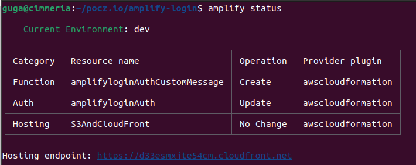
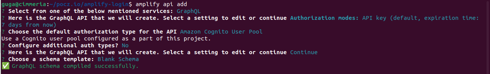

# Complete Login Flow using React, AWS Amplify (Auth with Cognito / GraphQL with DynamoDB / Hosting with S3 and CloudFront)


Running version: <https://amplifylogintutorial.pocz.io/>

## Part 1

Here: <https://www.linkedin.com/pulse/complete-login-flow-using-react-aws-amplify-auth-s3-jos%C3%A9-augusto/>

or here: <https://medium.com/@gugazimmermann/complete-login-flow-using-react-aws-amplify-auth-with-cognito-graphql-with-dynamodb-hosting-d0f10718e217>

Code: <https://github.com/gugazimmermann/amplify-login/tree/part-1>

## Part 2

Here: <https://www.linkedin.com/pulse/part-2-login-react-aws-amplify-cognito-multi-language-jos%C3%A9-augusto/>

or here: <https://medium.com/@gugazimmermann/part-2-complete-login-flow-using-react-aws-amplify-auth-with-cognito-graphql-with-dynamodb-aa3f47c09157>

Code: <https://github.com/gugazimmermann/amplify-login/tree/part-2>

## Part 3

## User Information

Code: <https://github.com/gugazimmermann/amplify-login/tree/v1.6>

At this point we have a multi-language React app using AWS Amplify to manage the login flow with Cognito, and host the app using S3 and CloudFront. The user are able to sign up, log in, and change the e-mail, password and language. But we want more info about the user.

Run `amplify status` to see the current cloud structure that we have.



Now we will use amplify GraphQL API, that uses AppSync and DynamoDB, and store the user Name and Birthdate… but you can add as many info you want.

Run `amplify api add`, select **GraphQL**, change the Authorization mode to A**mazon Cognito User Pool**, we don’t need any additional auth types, and select **Blank Schema**.



In the Schema add:

```GraphQL
type User @model @auth(rules: [{ allow: owner, operations: [create, read, update] }]) {
  id: ID! @primaryKey
  locale: String!
  email: AWSEmail! @index(name: "byEmail", queryField: "userByEmail")
  name: String
  birthdate: AWSDate
}
```

We have email as a @index, so we can query *userByEmail* and access the data. And since we are using Cognito as auth model, the object will have a Owner, that is the Cognito sub. Also, we don’t need anymore see the locale by the cognito object (we still need this info for the emails).

Run `amplify push` and yes to everything (or run `amplify push -y`).

Amplify will create the DynamoDB Table, configure AppSync and generate the queries, mutations and subscriptions in ther `/src` of the app.

When creating the GraphQL API you have the option to select Conflict Detection, this will enable DataStore, that is used when you want a app that is off-line first (is not your case now). And with DataStore you can run `amplify api console`, select GraphQL and open the Data Modeling, a very usefull to create the tables and the relationship between then.

## Create user in database

Code: <https://github.com/gugazimmermann/amplify-login/tree/v1.7>

If it is the first time the user login he will not have a record in the database, we need to create one. In this part we have a problem with React 18, that changes the way useEffect hook works in DEV. In production it will works normally, calling just one time, but in dev it will be called twice, making some strange behaviors, like add two times the user in the database. To avoid it we can change `index.js` and remove `StrictMode`

```JS
root.render(
  <BrowserRouter>
    <AppProvider>
      <App />
    </AppProvider>
  </BrowserRouter>
);
```

Now first we can create the APIs files to handle create and fetch user, we need this functions in a separate file just in case in the future we want to change the backend, like using a Rest API in place of the GraphQL.

`src/api/queries.js`

```JS
import { API, graphqlOperation } from "aws-amplify";
import * as queries from "../graphql/queries";

const GetUserByEmail = async (email) => {
  const data = await API.graphql(graphqlOperation(queries.userByEmail, { email }));
  return data.data.userByEmail.items.length ? data.data.userByEmail.items[0] : null;
};

const Queries = {
  GetUserByEmail,
};

export default Queries;
```

`src/api/mutations.js`

```JS
import { API, graphqlOperation } from "aws-amplify";
import * as mutations from "../graphql/mutations";

const CreateUser = async (email, locale) => {
  const {
    data: { createUser },
  } = await API.graphql(
    graphqlOperation(mutations.createUser, { input: { email, locale } })
  );
  return createUser;
};

const Mutations = {
  CreateUser,
};

export default Mutations;
```

And since we already have a app context we can add the user to it, making easy get some user information when needed and we don’t need to use the Cognito user object anymore.

In `src/constants/index.js` add the user Type

```JS
export const TYPES = {
  UPDATE_LANG: "UPDATE_LANG",
  UPDATE_USER: "UPDATE_USER",
};
```

in the context file `src/context/index.jsx` add user to the initial state

```JS
const initial = { 
  lang: "en-US",
  user: null,
 };
```

And add the function to update the user in the reducer `src/context/reducers.js`

```JS
function updateUser(state, payload) {
  const newState = { ...state, user: payload };
  saveState(newState);
  return newState;
}

export default function AppReducer(state, { type, payload }) {
  switch (type) {
    case TYPES.UPDATE_LANG:
      return updateLang(state, payload);
    case TYPES.UPDATE_USER:
      return updateUser(state, payload);
    default:
      throw new Error("TYPE NOT FOUND");
  }
}
```

Now in `src/pages/home/Layout.jsx` we will see if the user is logged in (if not we redirect to the Sign In page), we will also see if the user are in the database, if not we need to add, and the send the user information to the app context state.

```JS
import { useEffect, useState, useContext, useCallback } from "react";
import { Outlet, useNavigate } from "react-router-dom";
import { AppContext } from "../../context";
import { ROUTES, TYPES } from "../../constants";
import Auth from "../../api/auth";
import Queries from "../../api/queries";
import Mutations from "../../api/mutations";
import { Loading, Nav } from "../../components";

export default function Layout() {
  const { state, dispatch } = useContext(AppContext);
  const navigate = useNavigate();
  const [loading, setLoading] = useState(false);

  const loadUser = useCallback(async ({force, email, locale}) => {
    if (!state.user || force === true) {
      let user = await Queries.GetUserByEmail(email);
      if (!user) user = await Mutations.CreateUser(email, locale);
      dispatch({ type: TYPES.UPDATE_LANG, payload: locale || user.locale });
      dispatch({ type: TYPES.UPDATE_USER, payload: user });
    }
  }, []);

  const handleSignOut = async () => {
    await Auth.SignOut();
    dispatch({ type: TYPES.UPDATE_LANG, payload: state.user.locale });
    dispatch({ type: TYPES.UPDATE_USER, payload: null });
    navigate(ROUTES[state.lang].SIGN_IN);
  };

  useEffect(() => {
    const isUserLoggedIn = async () => {
      try {
        const attributes = await Auth.GetUser();
        await loadUser({
          email: attributes.email,
          locale: attributes.locale,
        });
      } catch (error) {
        navigate(ROUTES[state.lang].SIGN_IN);
      }
    };

    isUserLoggedIn();
  }, []);

  if (!state.user) return <Loading />;

  return (
    <main className="mx-auto h-screen">
      {loading && <Loading />}
      <Nav handleSignOut={handleSignOut} />
      <div className="mx-auto max-w-screen-lg p-4">
        <Outlet context={{ loadUser, setLoading }} />
      </div>
    </main>
  );
}
```

We also don’t need to pass the user as Outlet context, it’s already in the App Context.

In `src/components/Nav.jsx` remove the user from the props.

```JS
import { NavProfile } from ".";

const Nav = ({ handleSignOut }) => (
  <header className="w-full shadow-md z-30 px-2 py-1.5 bg-white text-slate-500">
    <div className="container mx-auto flex flex-wrap justify-between px-2">
      <p className="text-2xl">{process.env.REACT_APP_TITLE}</p>
      <NavProfile handleSignOut={handleSignOut} />
    </div>
  </header>
);

export default Nav;
```

and in `src/components/NavProfile.jsx` remove user from props and add the App Context.

```JS
import { useContext, useEffect, useState } from "react";
import { Link, useLocation } from "react-router-dom";
import { LANGUAGES, ROUTES } from "../constants";
import { AppContext } from "../context";
import { useCloseModal } from "../helpers";

const NavProfile = ({ handleSignOut }) => {
  const { state } = useContext(AppContext);
  const { user } = state;
  const location = useLocation();
  const [open, setOpen] = useState(false);
  const ref = useCloseModal(open, setOpen);
```

And just to correct another code, let’s change `src/pages/auth/AuthLayout.jsx` to loadUser inside the useEffect hook and avoid callback and render problems.

```JS
  useEffect(() => {
    const loadUser = async () => {
      setLoading(true);
      try {
        await Auth.GetUser();
        setLoading(false);
        navigate(ROUTES[state.lang].HOME);
      } catch (error) {
        setLoading(false);
      }
    };
    
    loadUser();
  }, []);
```

Home `src/pages/home/Home.jsx` is not used for anything useful right now, but is using the user getting from the outlet context, so let’s change:

```JS
import { useContext } from "react";
import { AppContext} from '../../context';

export default function Home() {
  const { state } = useContext(AppContext);
  const { user } = state;

  return <section>{user && <pre>{JSON.stringify(user, undefined, 2)}</pre>}</section>;
}
```

And the last file that we need to refactor is `src/pages/home/Profile.jsx`, this file also uses the user from the outlet.

```JS
import { useContext, useEffect, useState } from "react";
import { useOutletContext, useNavigate } from "react-router-dom";
import { LANGUAGES, ROUTES } from "../../constants";
import Auth from "../../api/auth";
import { Alert, Button, Form, Input, Select, Title } from "../../components";
import { isValidEmail } from "../../helpers";
import { AppContext } from "../../context";

export default function Profile() {
  const { state } = useContext(AppContext);
  const { user } = state;
  const navigate = useNavigate();
  const { loadUser, setLoading } = useOutletContext();
  const [alert, setAlert] = useState();

...

```

And you may have noticed that in `src/pages/home/Layout.jsx` we changed `loadUser` to receice a object `{force, email, locale}`, now we need to adjust the Profile. And also, the e-mail and language changes need to be done in the database too, not just the congnito.

```JS
...

  const handleVerifyCode = async () => {
    loading();
    try {
      await Auth.ConfirmChangeEmail(code);
      await Mutations.UpdateUser({ id: user.id, email, locale: user.locale });
      loadUser({ force: true, email });
      setShowCode(false);
      setAlert({
        type: "success",
        text: LANGUAGES[user.locale].Profile.EmailSuccess,
      });
    } catch (error) {
      handleErrors(error.message);
    }
    setLoading(false);
  };

...

  const handleChangeLanguage = async () => {
    loading();
    try {
      await Auth.ChangeLanguage(language);
      await Mutations.UpdateUser({ id: user.id, email: user.email, locale: language });
      loadUser({ force: true, email: user.email });
      navigate(ROUTES[language].PROFILE);
    } catch (error) {
      setAlert({ type: "error", text: error.message });
    }
    setLoading(false);
  };

...

```

And create the UpdateUser function `src/api/mutations.js`

```JS
... 

const UpdateUser = async ({ id, email, locale }) => {
  const {
    data: { updateUser },
  } = await API.graphql(
    graphqlOperation(mutations.updateUser, {
      input: { id, email, locale },
    })
  );
  return updateUser;
};

const Mutations = {
  CreateUser,
  UpdateUser,
};

```

## Split profile components, Update Name and Birth date

Code: <https://github.com/gugazimmermann/amplify-login/tree/v1.8>

Let’s use that for this app is mandatory the name and the birthdate, so the first time the user logged in this info is empty, we want to show it to the user using the alert component that we already have.

Fix let’s correct the page folders and put each component in the right folder.

Create a `src/pages/Layout/` folder and move `Layout.jsx` to it. Now create a `src/pages/Profile/` folder and move `Profile.jsx`. Change `src/App.js`:

```JS
... 

const Layout = lazy(() => import("./pages/Layout/Layout"));
const Home = lazy(() => import("./pages/home/Home"));
const Profile = lazy(() => import("./pages/Profile/Profile"));
...

```

In Home we want to show the Alert, but we need a small change in the Component `src/components/Alert.jsx`

```JS
...
  <div
    className={`my-2 text-center 
    ${!text && "hidden"} ${
      type === "error"
        ? "text-red-600"
        : type === "info"
        ? "text-indigo-600"
        : type === "warning"
        ? "bg-amber-400 text-white border border-amber-600 py-2"
        : "text-emerald-600"
    }`}
  >
...
```

And in `src/pages/home/Home.jsx`

```JS
import { useContext } from "react";
import { AppContext} from '../../context';
import { Alert } from '../../components';

export default function Home() {
  const { state } = useContext(AppContext);
  const { user } = state;

  return (
    <section>
      {(!user.name || !user.birthdate) && <Alert type="warning" text="Please, complete the Profile!" />}
    </section>
  );
}
```

Now when the user Login and don't have Name or Birthdate, will be alerted to update the profile.

The Profile page is getting to big, so we will refactor to slipt the components.

First we can do it with the Email box, create `src/pages/Profile/ProfileEmail.jsx`

```JS
import { useContext, useEffect, useState } from "react";
import { useOutletContext } from "react-router-dom";
import { AppContext } from "../../context";
import Auth from "../../api/auth";
import Mutations from "../../api/mutations";
import { LANGUAGES } from "../../constants";
import { isValidEmail } from "../../helpers";
import { Button, Form, Input, Title } from "../../components";

const ProfileEmail = ({handleErrors, setAlert}) => {
  const { state } = useContext(AppContext);
  const { user } = state;
  const { loadUser, setLoading } = useOutletContext();
  const [showCode, setShowCode] = useState(false);
  const [email, setEmail] = useState("");
  const [code, setCode] = useState("");

  useEffect(() => {
    user && setEmail(user?.email);
  }, [user]);

  const loading = () => {
    setAlert();
    setLoading(true);
  };

  const handleChangeEmail = async () => {
    loading();
    try {
      await Auth.ChangeEmail(email);
      setShowCode(true);
    } catch (error) {
      handleErrors(error.message);
    }
    setLoading(false);
  };

  const handleVerifyCode = async () => {
    loading();
    try {
      await Auth.ConfirmChangeEmail(code);
      await Mutations.UpdateUser({ id: user.id, email, locale: user.locale });
      loadUser({ force: true, email });
      setShowCode(false);
      setAlert({
        type: "success",
        text: LANGUAGES[user.locale].Profile.EmailSuccess,
      });
    } catch (error) {
      handleErrors(error.message);
    }
    setLoading(false);
  };

  const renderEmail = () => (
    <>
      <Input
        type="email"
        placeholder={LANGUAGES[user.locale].Email}
        value={email}
        handler={setEmail}
      />
      <Button
        text={LANGUAGES[user.locale].Profile.ChangeEmail}
        disabled={disabledEmail()}
        handler={() => handleChangeEmail()}
      />
    </>
  );

  const renderCode = () => (
    <>
      <Title
        text={LANGUAGES[user.locale].Profile.CodeAlert}
        color="text-amber-500"
        size="text-sm"
      />
      <Input type="text" placeholder="Code" value={code} handler={setCode} />
      <Button
        text="Send Code"
        disabled={disabledCode()}
        handler={() => handleVerifyCode()}
      />
    </>
  );

  const disabledEmail = () =>
    !email || email === user.email || !isValidEmail(email);

  const disabledCode = () => !code || code.length > 6;

  return (
    <Form>
      <div className="mb-4 w-full flex flex-col gap-4 justify-center">
        {!showCode ? renderEmail() : renderCode()}
      </div>
    </Form>
  );
};

export default ProfileEmail;

```

And then `src/pages/Profile/ProfileChangePassword.jsx`

```JS
import { useContext, useState } from "react";
import { useOutletContext } from "react-router-dom";
import { AppContext } from "../../context";
import { LANGUAGES } from "../../constants";
import Auth from "../../api/auth";
import { Button, Form, Input } from "../../components";

const ProfileChangePassword = ({handleErrors, setAlert}) => {
  const { state } = useContext(AppContext);
  const { user } = state;
  const { setLoading } = useOutletContext();
  const [currentPassword, setCurrentPassword] = useState("");
  const [newPassword, setNewPassword] = useState("");
  const [repeatPassword, setRepeatPassword] = useState("");

  const loading = () => {
    setAlert();
    setLoading(true);
  };

  const handlePassword = async () => {
    loading();
    try {
      await Auth.ChangePassword(currentPassword, newPassword);
      setAlert({
        type: "success",
        text: LANGUAGES[user.locale].Profile.PasswordSuccess,
      });
    } catch (error) {
      handleErrors(error.message);
    }
    setLoading(false);
  };

  const disabledPassword = () =>
    !currentPassword ||
    newPassword !== repeatPassword ||
    newPassword.length < 8;

  return (
    <Form>
      <div className="mb-4 w-full flex flex-col gap-4 justify-center">
        <Input
          type="password"
          placeholder={LANGUAGES[user.locale].Profile.CurrentPassword}
          value={currentPassword}
          handler={setCurrentPassword}
        />
        <Input
          type="password"
          placeholder={LANGUAGES[user.locale].Profile.NewPassword}
          value={newPassword}
          handler={setNewPassword}
          showTooltip
        />
        <Input
          type="password"
          placeholder={LANGUAGES[user.locale].Profile.RepeatNewPassword}
          value={repeatPassword}
          handler={setRepeatPassword}
        />
        <Button
          text={LANGUAGES[user.locale].Profile.ChangePassword}
          disabled={disabledPassword()}
          handler={() => handlePassword()}
        />
      </div>
    </Form>
  );
};

export default ProfileChangePassword;

```

and at least `src/pages/Profile/ProfileLanguage.jsx`

```JS
import { useContext, useState } from "react";
import { useOutletContext, useNavigate } from "react-router-dom";
import { AppContext } from "../../context";
import Auth from "../../api/auth";
import Mutations from "../../api/mutations";
import { LANGUAGES, ROUTES } from "../../constants";
import { Button, Form, Select } from "../../components";

const ProfileLanguage = ({ setAlert }) => {
  const { state } = useContext(AppContext);
  const { user } = state;
  const navigate = useNavigate();
  const { loadUser, setLoading } = useOutletContext();
  const [language, setLanguage] = useState(user.locale);

  const loading = () => {
    setAlert();
    setLoading(true);
  };

  const handleChangeLanguage = async () => {
    loading();
    try {
      await Auth.ChangeLanguage(language);
      await Mutations.UpdateUser({
        id: user.id,
        email: user.email,
        locale: language,
      });
      loadUser({ force: true, email: user.email });
      navigate(ROUTES[language].PROFILE);
    } catch (error) {
      setAlert({ type: "error", text: error.message });
    }
    setLoading(false);
  };

  const disabledLanguage = () => language === user.locale;

  return (
    <Form>
      <div className="mb-4 w-full flex flex-col gap-4 justify-center">
        <Select value={language} handler={setLanguage}>
          {Object.keys(LANGUAGES).map((l) => (
            <option key={l} value={l}>
              {LANGUAGES[user.locale].Languages[l]}
            </option>
          ))}
        </Select>
        <Button
          text={LANGUAGES[user.locale].Profile.ChangeLanguage}
          disabled={disabledLanguage()}
          handler={() => handleChangeLanguage()}
        />
      </div>
    </Form>
  );
};

export default ProfileLanguage;

```

And then `src/pages/Profile/Profile.jsx`

```JS
import { useCallback, useContext, useState } from "react";
import { LANGUAGES, ROUTES } from "../../constants";
import { Alert, Title } from "../../components";
import { AppContext } from "../../context";
import ProfileEmail from "./ProfileEmail";
import ProfileChangePassword from "./ProfileChangePassword";
import ProfileLanguage from "./ProfileLanguage";

export default function Profile() {
  const { state } = useContext(AppContext);
  const { user } = state;
  const [alert, setAlert] = useState();

  const handleErrors = useCallback((message) => {
    let errorMessage = message;
    switch (message) {
      case "Attempt limit exceeded, please try after some time.":
        errorMessage = LANGUAGES[user.locale].CommonError.AttemptLimit;
        break;
      case "An account with the given email already exists.":
        errorMessage = LANGUAGES[user.locale].CommonError.Email;
        break;
      case "Invalid verification code provided, please try again.":
        errorMessage = LANGUAGES[user.locale].CommonError.CodeError;
        break;
      case "Incorrect username or password.":
        errorMessage = LANGUAGES[user.locale].CommonError.Password;
        break;
      case "Password did not conform with policy: Password must have symbol characters":
        errorMessage = LANGUAGES[user.locale].CommonError.NewPassword;
        break;
      default:
        errorMessage = message;
    }
    setAlert({ type: "error", text: errorMessage });
  }, []);

  return (
    <section>
      <Title
        text={LANGUAGES[user.locale].Profile.Profile}
        back={ROUTES[user.locale].HOME}
      />
      {alert?.type && <Alert type={alert?.type} text={alert?.text} /> }
      <div className="grid sm:grid-cols-3 gap-2">
        <ProfileEmail  handleErrors={handleErrors} setAlert={setAlert} />
        <ProfileChangePassword handleErrors={handleErrors} setAlert={setAlert} />
        <ProfileLanguage setAlert={setAlert} />
      </div>
    </section>
  );
}

```

Now we can create a form to permit the user change the attributes, but here we have one trick… date format changes from locale… in pt-BR we use DD/MM/YYYY, but in en-US we use YYYY-MM-DD, we need a helper to handle it.

`src/helpers/formatDate.js`

```JS
import moment from "moment";

const Show = (date, locale) => {
  if (locale === "pt-BR")
    return moment(date, "YYYY-MM-DD").format("DD/MM/YYYY");
  return moment(date, "YYYY-MM-DD").format("YYYY-MM-DD");
};

const Format = (date, locale) => {
  console.log(date, locale);
  if (!date) return date;
  const currentValue = date.replace(/[^\d]/g, "");
  const cvLength = currentValue.length;
  const formated =
    locale === "pt-BR"
      ? formatDDMMYYYY(cvLength, currentValue)
      : formatYYYYMMDD(cvLength, currentValue);
  return formated;
};

const formatDDMMYYYY = (cvLength, currentValue) => {
  if (cvLength < 2) return currentValue;
  if (cvLength < 4)
    return `${currentValue.slice(0, 2)}/${currentValue.slice(2)}`;
  return `${currentValue.slice(0, 2)}/${currentValue.slice(
    2,
    4
  )}/${currentValue.slice(4, 8)}`;
};

const formatYYYYMMDD = (cvLength, currentValue) => {
  if (cvLength < 4) return currentValue;
  if (cvLength < 5)
    return `${currentValue.slice(0, 4)}-${currentValue.slice(5)}`;
  return `${currentValue.slice(0, 4)}-${currentValue.slice(
    4,
    6
  )}-${currentValue.slice(6, 8)}`;
};

const FormatDate = { Show, Format };

export default FormatDate;

```

`src/helpers/index.js`

```JS
export { default as FormatDate } from "./formatDate";
export { default as isValidEmail } from "./isValidEmail";
export { default as useCloseModal } from "./useCloseModal";

```

And we will probably uses the Birthdate in other parts of the code, so using a package to help is a good thing… moment is a well know package to help with dates, let’s install it running `npm install moment`.

Now let’s add `src/pages/Profile/ProfileAttributes.jsx`

```JS
import { useContext, useEffect, useState } from "react";
import { useOutletContext } from "react-router-dom";
import { AppContext } from "../../context";
import { LANGUAGES } from "../../constants";
import Mudations from "../../api/mutations";
import { Button, Form, Input } from "../../components";
import { FormatDate } from "../../helpers";
import moment from "moment";

const ProfileAttributes = ({ handleErrors, setAlert }) => {
  const { state } = useContext(AppContext);
  const { user } = state;
  const { loadUser, setLoading } = useOutletContext();
  const [name, setName] = useState("");
  const [birthdate, setBithdate] = useState("");

  useEffect(() => {
    if (user) {
      setName(user?.name || "");
      setBithdate(FormatDate.Show(user?.birthdate, user.locale) || "");
    }
  }, [user]);

  const loading = () => {
    setAlert();
    setLoading(true);
  };

  const handleAttributes = async () => {
    loading();
    try {
      const birthdateFormated =
        user.locale === "pt-BR"
          ? moment(birthdate, "DD/MM/YYYY").format("YYYY-DD-MM")
          : moment(birthdate, "YYYY-MM-DD").format("YYYY-MM-DD");
      await Mudations.UpdateUser({
        id: user.id,
        email: user.email,
        locale: user.locale,
        name,
        birthdate: birthdateFormated,
      });
      loadUser({ force: true, email: user.email });
      setAlert({
        type: "success",
        text: LANGUAGES[user.locale].Profile.AttributesSuccess,
      });
    } catch (error) {
      handleErrors(error.message);
    }
    setLoading(false);
  };

  const handleFormatDate = (date) => setBithdate(FormatDate.Format(date, user.locale));

  const disabledAttributes = () => !name || !birthdate;

  return (
    <Form>
      <div className="mb-4 w-full flex flex-col gap-4 justify-center">
        <Input
          type="text"
          placeholder={LANGUAGES[user.locale].Profile.Name}
          value={name}
          handler={setName}
          error={!name}
        />
        <Input
          type="text"
          placeholder={LANGUAGES[user.locale].Profile.Birthdate}
          value={birthdate}
          handler={handleFormatDate}
          error={!birthdate}
        />
        <Button
          text={LANGUAGES[user.locale].Profile.ChangeAttributes}
          disabled={disabledAttributes()}
          handler={() => handleAttributes()}
        />
      </div>
    </Form>
  );
};

export default ProfileAttributes;

```

Now add `ProfileAttributes` in  `src/pages/Profile/Profile.jsx`

```JS
...
import ProfileAttributes from "./ProfileAttributes";
...

      <div className="grid sm:grid-cols-2 gap-2">
        <ProfileAttributes handleErrors={handleErrors} setAlert={setAlert} />
        <ProfileLanguage setAlert={setAlert} />
        <ProfileChangePassword handleErrors={handleErrors} setAlert={setAlert} />
        <ProfileEmail handleErrors={handleErrors} setAlert={setAlert} />
      </div>

...

```

And that's it... now we have the Login flow running, the user can change information in the Profile, change the language of the app and also receive Cognito's emails in the same language the was chosen, and change the personal attributes.

In the next article I’ll show how to use Amplify to performing self-service KYC (Know your customer), using Amazon Rekognition, Amazon Comprehend and other AWS resources...

----

You can see the final code here: https://github.com/gugazimmermann/amplify-login

and try the App here: https://amplifylogintutorial.pocz.io/

And you can add me on LinkedIn https://www.linkedin.com/in/guga-zimmermann/