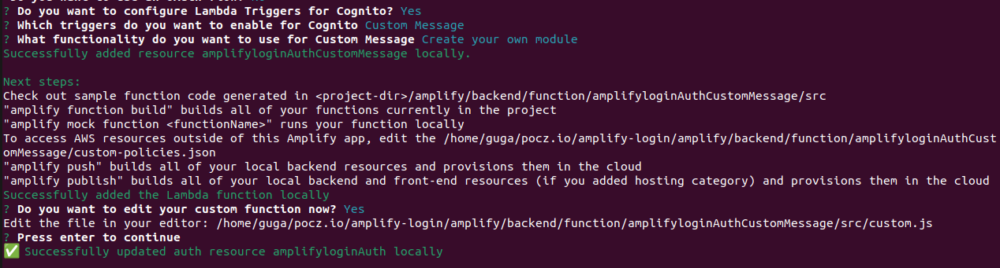
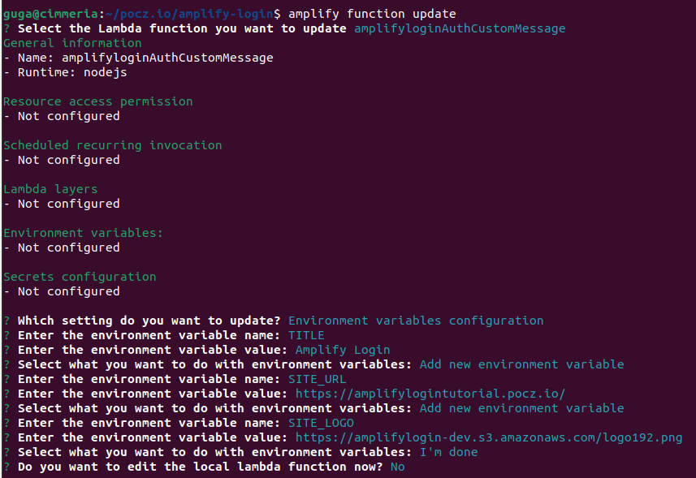

# Complete Login Flow using React, AWS Amplify (Auth with Cognito / GraphQL with DynamoDB / Hosting with S3 and CloudFront)


Running version: <https://amplifylogintutorial.pocz.io/>

## Part 1

Here: <https://www.linkedin.com/pulse/complete-login-flow-using-react-aws-amplify-auth-s3-jos%C3%A9-augusto/>

or here: <https://medium.com/@gugazimmermann/complete-login-flow-using-react-aws-amplify-auth-with-cognito-graphql-with-dynamodb-hosting-d0f10718e217>

Code: <https://github.com/gugazimmermann/amplify-login/tree/part-1>

## PART 2

## Multi-Language App With Cognito

Code: <https://github.com/gugazimmermann/amplify-login/tree/v1.2>

We already have a running app using Amplify / Cognito, now we want to make this app multi-language. For this we need a flag component to let user change the language, a context to store this information before the user login and translate the routes and text of the app.

For now we will use just English and Portuguese, but can be translated to any other language and have any number os languages to choose.

First of all open the `.env` file and add `REACT_APP_STATE=amplifylogin`, remember to re-start the app to load the env vars (`npm start`).

Create a file to store the constants `src/constants/index.js`

```JS
import { pt_br_lang, en_us_lang } from "./languages";
import { pt_br_routes, en_us_routes } from "./routes";

export const STATENAME = process.env.REACT_APP_STATE || "amplifylogin";

export const TYPES = {
  UPDATE_LANG: "UPDATE_LANG",
};

export const LANGUAGES = {
  "en-US": en_us_lang,
  "pt-BR": pt_br_lang,
};

export const ROUTES = {
  "en-US": en_us_routes,
  "pt-BR": pt_br_routes,
};
```

and translate the Routes.

`src/constants/routes/en_us.js`

```JS
const en_us_routes = {
  SIGN_IN: "/",
  FORGOT_PASSWORD: "/forgot-password",
  REDEFINE_PASSWORD: "/redefine-password",
  SIGN_UP: "/registration",
  CONFIRM_SIGN_UP: "/confirm-registration",
  HOME: "/home",
  PROFILE: "/profile",
};

export default en_us_routes;

```

`src/constants/routes/pt_br.js`

```JS
const pt_br_routes = {
  SIGN_IN: "/",
  FORGOT_PASSWORD: "/esqueceu-senha",
  REDEFINE_PASSWORD: "/redefinir-senha",
  SIGN_UP: "/registro",
  CONFIRM_SIGN_UP: "/confirmar-registro",
  HOME: "/inicial",
  PROFILE: "/perfil",
};

export default pt_br_routes;

```

`src/constants/routes/index.js`

```JS
export { default as pt_br_routes } from "./pt_br";
export { default as en_us_routes } from "./en_us";

```

If the user choose english, the URL will be in english, if choose portugue the URL will be in portuguese.

Now we need to translate all the app, let's do it in parts, don't matter if we need to repeat one or another word, at the end will be better if we want to add more languages and someone help with the translation, because each part have it own context and expressions.

`src/constants/languages/en_us.js`

```JS
const en_us_lang = {
  Loading: "Loading",
  Email: "Email",
  Password: "Password",
  Code: "Code",
  PasswordRules: {
    Chars: "Must have at least 8 chars",
    Lowercase: "Requires Lowercase",
    Uppercase: "Requires Uppercase",
    Number: "Requires Number",
    Symbol: "Requires Symbol",
  },
  NotFound: {
    Sorry: "Sorry",
    PageNotFound: "Page Not Found",
  },
  CommonError: {
    Login: "Sorry, Unable to login",
    SendCode: "Unable to send code, email is correct?",
    RedefinePassword:
      "Unable to redefine password, email, code or new password are wrong!",
    SignUp: "Unable to Register. Email already exists or Password are wrong!",
    ConfirmSignUp: "Unable to confirm registration, email or code are wrong!",
    CodeError: "Invalid verification code provided, please try again.",
    EmailError: "An account with the given email already exists.",
  },
  Auth: {
    SignInTitle: "Sign In",
    RememberMe: "Remember Me",
    ForgotPassword: "Forgot Password?",
    ForgotPasswordSuccess: "Check your Email",
    SignInButton: "Sign In",
    NotRegistered: "Not Registered?",
    ForgotPasswordTitle: "Forgot Password",
    SendCode: "Send Code",
    BackToSignIn: "Back to Sign In",
    RedefinePasswordTitle: "Redefine Password",
    RepeatPassword: "Repeat Password",
    RedefinePasswordSuccess: "Password changed successfully!",
    RedefinePasswordButton: "Redefine Password",
    SignUpTitle: "Sign Up",
    SignUpSuccess: "Check your Email",
    SignUpButton: "Sign Up",
    ConfirmRegistrationTitle: "Confirm Registration",
    ResendConfirmationCode: "Resend Confirmation Code",
    ResendConfirmationSuccess: "Code Resent, Check your Email",
    ConfirmRegistrationSuccess: "Confirmation successful!",
    ConfirmRegistrationButton: "Confirm",
  },
  Profile: {
    Profile: "Profile",
    SignOut: "Sign Out",
    ChangeEmail: "Change Email",
    CurrentPassword: "Current Password",
    NewPassword: "New Password",
    RepeatNewPassword: "Repeat New Password",
    ChangePassword: "Change Password",
    CodeAlert: "Please, check your email and send the code.",
    EmailSuccess: "Email changed successfully!",
    PasswordSuccess: "Password changed successfully!",
  },
};

export default en_us_lang;

```

`src/constants/languages/pt_br.js`

```JS
 const pt_br_lang = {
  Loading: "Carregando",
  Email: "Email",
  Password: "Senha",
  Code: "Código",
  PasswordRules: {
    Chars: "Pelo menos 8 caracteres",
    Lowercase: "Requer Minúsculas",
    Uppercase: "Requer Maiúsculas",
    Number: "Requer Número",
    Symbol: "Requer Símbolo",
  },
  NotFound: {
    Sorry: "Desculpe",
    PageNotFound: "Página Não Encontrada",
  },
  CommonError: {
    Login: "Desculpe, Não foi possível entrar",
    SendCode: "Não foi possível enviar o código, o email está correto?",
    RedefinePassword:
      "Não foi possível redefinir a senha, e-mail, código ou nova senha estão errados!",
    SignUp:
      "Não foi possível registrar. O e-mail já existe ou a senha está errada!",
    ConfirmSignUp:
      "Não foi possível confirmar o registro, e-mail ou código estão errados!",
    CodeError: "Código de verificação inválido. Tente novamente.",
    EmailError: "Já existe uma conta com este e-mail.",
  },
  Auth: {
    SignInTitle: "Entrar",
    RememberMe: "Manter Conectado",
    ForgotPassword: "Esqueceu a Senha?",
    ForgotPasswordSuccess: "Verifique seu Email",
    SignInButton: "Entrar",
    NotRegistered: "Não tem Registro?",
    ForgotPasswordTitle: "Esqueceu a Senha?",
    SendCode: "Enviar Código",
    BackToSignIn: "Votlar para Entrar",
    RedefinePasswordTitle: "Redefinir Senha",
    RepeatPassword: "Repita a Senha",
    RedefinePasswordSuccess: "Senha Alterada com Sucesso!",
    RedefinePasswordButton: "Redefinir Senha",
    SignUpTitle: "Registro",
    SignUpSuccess: "Verifique seu Email",
    SignUpButton: "Registrar",
    ConfirmRegistrationTitle: "Confirmar Registro",
    ResendConfirmationCode: "Re-enviar Código de Confirmação",
    ResendConfirmationSuccess: "Código enviado, verifique seu email",
    ConfirmRegistrationSuccess: "Confirmação realizada com sucesso!",
    ConfirmRegistrationButton: "Confirmar",
  },
  Profile: {
    Profile: "Perfil",
    SignOut: "Sair",
    ChangeEmail: "Alterar Email",
    CurrentPassword: "Senha Atual",
    NewPassword: "Nova Senha",
    RepeatNewPassword: "Repetir Nova Senha",
    ChangePassword: "Alterar Senha",
    CodeAlert: "Por favor, verifique seu email e envie o código.",
    EmailSuccess: "Email alterado com sucesso!",
    PasswordSuccess: "Senha alterada com sucesso!",
  },
};

export default pt_br_lang;

```

`src/constants/languages/index.js`

```JS
export { default as pt_br_lang } from "./pt_br";
export { default as en_us_lang } from "./en_us";

```

Now we can move on and create the app context, so the user can choose a language before to the login, and using the localStorage we can remember what language the user want to see the app.

First create the Reducer, that will receive the dispatch event and the payload to change the language.

`src/context/reducers.js`

```JS
import { STATENAME, TYPES } from "../constants";

function saveState(state) {
  localStorage.setItem(STATENAME, JSON.stringify(state));
}

function updateLang(state, payload) {
  const newState = { ...state, lang: payload };
  saveState(newState);
  return newState;
}

export default function AppReducer(state, { type, payload }) {
  switch (type) {
    case TYPES.UPDATE_LANG:
      return updateLang(state, payload);
    default:
      throw new Error("TYPE NOT FOUND");
  }
}

```

And now the Context

`src/context/index.jsx`

```JS
import React, { createContext, useReducer } from "react";
import { STATENAME } from "../constants";
import AppReducer from "./reducers";

const initial = { lang: "en-US" };

const getState = () =>
  localStorage.getItem(STATENAME)
    ? JSON.parse(localStorage.getItem(STATENAME))
    : initial;

const mainReducer = (state, action) => AppReducer(state, action);

const AppContext = createContext({ state: getState(), dispatch: () => null });

function AppProvider({ children }) {
  const [state, dispatch] = useReducer(mainReducer, getState());
  return (
    <AppContext.Provider value={{ state, dispatch }}>
      {children}
    </AppContext.Provider>
  );
}

export { AppProvider, AppContext };

```

And to access this, we need to change the index to encapsulate the app inside the context.

`src/index.js`

```JS
import React from "react";
import ReactDOM from "react-dom/client";
import { BrowserRouter } from "react-router-dom";
import { Amplify } from "aws-amplify";
import awsconfig from "./aws-exports";
import { AppProvider } from "./context";
import "./index.css";
import App from "./App";
import reportWebVitals from "./reportWebVitals";

Amplify.configure(awsconfig);

const root = ReactDOM.createRoot(document.getElementById("root"));
root.render(
  <React.StrictMode>
    <BrowserRouter>
      <AppProvider>
        <App />
      </AppProvider>
    </BrowserRouter>
  </React.StrictMode>
);

```

The user need to have a way to change the language, we will provide this with a flag component, that will show the flags in the right top of the app.

First we need the flags images and a arrow, that will give the hint to the user to click in the flag and change if needed. The two flags that we will use for now can be found here: <https://github.com/gugazimmermann/amplify-login/tree/main/src/images/flags>.

And we can create the arrow as a component, because we want to change the style to rotate when the menu is open or closed.

`src/images/Arrow.jsx`

```JS
export default function Arrow({ styles }) {
  return (
    <svg
      aria-hidden="true"
      className={styles}
      fill="currentColor"
      viewBox="0 0 20 20"
      xmlns="http://www.w3.org/2000/svg"
    >
      <path
        fillRule="evenodd"
        d="M5.293 7.293a1 1 0 011.414 0L10 10.586l3.293-3.293a1 1 0 111.414 1.414l-4 4a1 1 0 01-1.414 0l-4-4a1 1 0 010-1.414z"
        clipRule="evenodd"
      />
    </svg>
  );
}
```

The Flag component will change the context state when the user select a language and also change the current route that the user in in the moment.

`src/components/Flags.jsx`

```JS
import { useContext, useState } from "react";
import { useLocation, useNavigate } from "react-router-dom";
import { AppContext } from "../context";
import { LANGUAGES, ROUTES, TYPES } from "../constants";
import { useCloseModal } from "../helpers";
import Arrow from "../images/Arrow";
import BR from "../images/flags/pt-BR.svg";
import EN from "../images/flags/en-US.svg";

export default function Flags() {
  const location = useLocation();
  const navigate = useNavigate();
  const { state, dispatch } = useContext(AppContext);
  const [open, setOpen] = useState(false);
  const ref = useCloseModal(open, setOpen);

  function showFlag(lang) {
    if (lang === "pt-BR")
      return ;
    return ;
  }

  function handleChangeLanguage(lang) {
    const currentRoute = Object.keys(ROUTES[state.lang])
      .map((k) => ({ key: k, value: ROUTES[state.lang][k] }))
      .find((r) => r.value === location.pathname);
    dispatch({ type: TYPES.UPDATE_LANG, payload: lang });
    navigate(ROUTES[lang][currentRoute.key]);
    setOpen(false);
  }

  return (
    <div className="absolute top-2 right-2 z-50">
      <button
        type="button"
        className="flex items-center px-1"
        onClick={() => setOpen(!open)}
      >
        {showFlag(state.lang)}
        <Arrow styles={`ml-1 w-4 h-4 ${open && "rotate-180"}`} />
      </button>
      <ul
        ref={ref}
        className={`flex flex-col items-start pl-1 mt-2 ${!open && "hidden"}`}
      >
        {Object.keys(LANGUAGES)
          .filter((l) => l !== state.lang)
          .map((l) => (
            <li key={l}>
              <button type="button" onClick={() => handleChangeLanguage(l)}>
                {showFlag(l)}
              </button>
            </li>
          ))}
      </ul>
    </div>
  );
}
```

and in the components export's file `src/components/index.js` add `export { default as Flags } from "./Flags";`

The routes need to be dynamic now, so change `src/App.js` to receive the current user language and handle the routes.

```JS
import { lazy, Suspense, useContext } from "react";
import { Routes, Route } from "react-router-dom";
import { AppContext } from "./context";
import { ROUTES } from "./constants";
import { Loading } from "./components";

...

function App() {
  const { state } = useContext(AppContext);

  return (
    <Suspense fallback={<Loading />}>
      <Routes>
        <Route element={<AuthLayout />}>
          <Route path={ROUTES[state.lang].SIGN_IN} element={<SignIn />} />
          <Route
            path={ROUTES[state.lang].FORGOT_PASSWORD}
            element={<ForgotPassword />}
          />
          <Route
            path={ROUTES[state.lang].REDEFINE_PASSWORD}
            element={<RedefinePassword />}
          />
          <Route path={ROUTES[state.lang].SIGN_UP} element={<SignUp />} />
          <Route
            path={ROUTES[state.lang].CONFIRM_SIGN_UP}
            element={<ConfirmSignUp />}
          />
        </Route>
        <Route element={<Layout />}>
          <Route path={ROUTES[state.lang].HOME} element={<Home />} />
          <Route path={ROUTES[state.lang].PROFILE} element={<Profile />} />
        </Route>
        <Route path="*" element={<NotFound />} />
      </Routes>
    </Suspense>
  );
}

```

And in the AuthLayout we need to add the Flag component, change all navigate to dynamic routes, and algo all the hard coded text to be dynamic too.

The final `src/pages/auth/AuthLayout.jsx` will be like this:

```JS
import { useEffect, useState, useContext } from "react";
import { Outlet, useNavigate } from "react-router-dom";
import { AppContext } from "../../context";
import { LANGUAGES, ROUTES } from "../../constants";
import Auth from "../../api/auth";
import { Alert, Flags, Loading } from "../../components";

export default function AuthLayout() {
  const navigate = useNavigate();
  const { state } = useContext(AppContext);
  const [img, setImg] = useState();
  const [loading, setLoading] = useState(false);
  const [alert, setAlert] = useState();
  const startLoading = () => {
    setLoading(true);
    setAlert();
  };
  const stopLoading = () => {
    setLoading(false);
    setAlert();
  };
  const signIn = async (email, pwd, remember) => {
    startLoading();
    try {
      await Auth.SignIn(email, pwd, remember);
      stopLoading();
      navigate(ROUTES[state.lang].HOME);
    } catch (err) {
      stopLoading();
      setAlert({
        type: "error",
        text: LANGUAGES[state.lang].CommonError.Login,
      });
    }
  };

  const sendForgotPasswordCode = async (email) => {
    startLoading();
    try {
      await Auth.ForgotPassword(email);
      stopLoading();
      navigate(ROUTES[state.lang].REDEFINE_PASSWORD, {
        state: {
          email,
          alert: {
            type: "info",
            text: LANGUAGES[state.lang].Auth.ForgotPasswordSuccess,
          },
        },
      });
    } catch (err) {
      stopLoading();
      setAlert({
        type: "error",
        text: LANGUAGES[state.lang].CommonError.SendCode,
      });
    }
  };
  const redefinePassword = async (email, code, pwd) => {
    startLoading();
    try {
      await Auth.RedefinePassword(email, code, pwd);
      stopLoading();
      navigate(ROUTES[state.lang].SIGN_IN, {
        state: {
          email,
          alert: {
            type: "success",
            text: LANGUAGES[state.lang].Auth.RedefinePasswordSuccess,
          },
        },
      });
    } catch (err) {
      stopLoading();
      setAlert({
        type: "error",
        text: LANGUAGES[state.lang].CommonError.RedefinePassword,
      });
    }
  };
  const signUp = async (email, pwd) => {
    startLoading();
    try {
      await Auth.SignUp(email, pwd, "en-US");
      stopLoading();
      navigate(ROUTES[state.lang].CONFIRM_SIGN_UP, {
        state: {
          email,
          alert: {
            type: "info",
            text: LANGUAGES[state.lang].Auth.SignUpSuccess,
          },
        },
      });
    } catch (err) {
      stopLoading();
      setAlert({
        type: "error",
        text: LANGUAGES[state.lang].CommonError.SignUp,
      });
    }
  };
  const resendConfirmationCode = async (email) => {
    startLoading();
    try {
      await Auth.ResendConfirmationCode(email);
      stopLoading();
      navigate(ROUTES[state.lang].CONFIRM_SIGN_UP, {
        state: {
          email,
          alert: {
            type: "success",
            text: LANGUAGES[state.lang].Auth.ResendConfirmationSuccess,
          },
        },
      });
    } catch (err) {
      stopLoading();
      setAlert({
        type: "error",
        text: LANGUAGES[state.lang].CommonError.SendCode,
      });
    }
  };
  const confirmSignUp = async (email, code) => {
    startLoading();
    try {
      await Auth.ConfirmSignUp(email, code);
      stopLoading();
      navigate(ROUTES[state.lang].SIGN_IN, {
        state: {
          email,
          alert: {
            type: "success",
            text: LANGUAGES[state.lang].Auth.ConfirmRegistrationSuccess,
          },
        },
      });
    } catch (err) {
      stopLoading();
      setAlert({
        type: "error",
        text: LANGUAGES[state.lang].CommonError.ConfirmSignUp,
      });
    }
  };
  const loadUser = async () => {
    setLoading(true);
    try {
      await Auth.GetUser();
      setLoading(false);
      navigate(ROUTES[state.lang].HOME);
    } catch (error) {
      setLoading(false);
    }
  };
  useEffect(() => {
    loadUser();
  }, []);
  return (
    <main className="h-screen mx-auto bg-white">
      {loading && <Loading />}
      <section className="container h-full fixed">
        {Flags()}
        <div className="h-full flex flex-col-reverse md:flex-row items-center justify-evenly">
          <div className="w-10/12 md:w-6/12 lg:w-4/12 md:mb-0">
            {img && }
          </div>
          <div className="w-10/12 md:w-5/12 lg:w-4/12">
            <Alert type={alert?.type} text={alert?.text} />
            <Outlet
              context={{
                setImg,
                setAlert,
                signIn,
                sendForgotPasswordCode,
                redefinePassword,
                signUp,
                resendConfirmationCode,
                confirmSignUp,
              }}
            />
          </div>
        </div>
      </section>
    </main>
  );
}

```

And every auth component that have hard coded text or route need to be updated, and also the not found page:

`src/components/Input.jsx`

```JS
import { useState, useContext } from "react";
import { AppContext } from "../context";
import { LANGUAGES } from "../constants";

const Input = ({ type, placeholder, value, handler, showTooltip }) => {
  const { state } = useContext(AppContext);
  const [inputType, setInputType] = useState(type);
  const [tooltip, setTooltip] = useState(false);

...


  <li>{LANGUAGES[state.lang].PasswordRules.Chars}</li>
  <li>{LANGUAGES[state.lang].PasswordRules.Lowercase}</li>
  <li>{LANGUAGES[state.lang].PasswordRules.Uppercase}</li>
  <li>{LANGUAGES[state.lang].PasswordRules.Number}</li>
  <li>{LANGUAGES[state.lang].PasswordRules.Symbol}</li>

...

```

`src/components/Loading.jsx`

```JS
import { useContext } from "react";
import { AppContext } from "../context";
import { LANGUAGES } from "../constants";

const Loading = () => {
  const { state } = useContext(AppContext);

  return (
    <div className="fixed inset-0 bg-gray-900 bg-opacity-90 overflow-y-auto h-full w-full z-50">
      <div className="flex flex-col justify-center items-center h-full w-full">
        <div className="mb-4 text-indigo-500 text-2xl font-bold">
          {LANGUAGES[state.lang].Loading}...
        </div>
        <div className="animate-spin rounded-full h-32 w-32 border-b-8 border-indigo-500" />
      </div>
    </div>
  );
};

export default Loading;

```

`src/components/RememberMe.jsx`

```JS
import { useContext } from "react";
import { AppContext } from "../context";
import { LANGUAGES } from "../constants";

const RememberMe = ({ remember, setRemember }) => {
  const { state } = useContext(AppContext);

  return (
    <div className="form-group form-check">
      <input
        type="checkbox"
        name="checkbox"
        id="checkbox"
        defaultChecked={remember}
        onChange={() => setRemember(!remember)}
        className="form-check-input appearance-none h-4 w-4 border border-gray-300 rounded-sm bg-white checked:bg-indigo-500 checked:border-indigo-500 focus:outline-none transition duration-200 mt-1 align-top bg-no-repeat bg-center bg-contain float-left mr-2 cursor-pointer"
      />
      <label className="form-check-label inline-block" htmlFor="checkbox">
        {LANGUAGES[state.lang].Auth.RememberMe}
      </label>
    </div>
  );
};

export default RememberMe;

```

`src/pages/not-found/NotFound.jsx`

```JS
import { useContext } from "react";
import { AppContext } from "../../context";
import { LANGUAGES } from "../../constants";
import NotFoundImg from "../../images/not_found.svg";

const NotFound = () => {
  const { state } = useContext(AppContext);

  return (
    <div className="container bg-white mx-auto">
      <main className="flex flex-col h-screen justify-center items-center">
        
        <h1 className="mt-4 text-xl">
          {LANGUAGES[state.lang].NotFound.Sorry},{" "}
          {LANGUAGES[state.lang].NotFound.PageNotFound}.
        </h1>
      </main>
    </div>
  );
};

export default NotFound;

```

And the same for the auth pages:

`src/pages/auth/ConfirmSignUp.jsx`

```JS
import { useEffect, useState, useContext } from "react";
import { useOutletContext, useLocation } from "react-router-dom";
import { AppContext } from "../../context";
import { LANGUAGES, ROUTES } from "../../constants";
import { isValidEmail } from "../../helpers";
import { AuthLink, AuthTitle, Button, Input } from "../../components";
import ConfirmSignUpImage from "../../images/confirm_signup.svg";

export default function ConfirmSignUp() {
  const location = useLocation();
  const { state } = useContext(AppContext);
  const { setImg, setAlert, resendConfirmationCode, confirmSignUp } =
    useOutletContext();
  const [email, setEmail] = useState(location?.state?.email || "");
  const [code, setCode] = useState("");
  useEffect(() => {
    setImg(ConfirmSignUpImage);
    setAlert(location?.state?.alert);
  }, [location?.state?.alert, setAlert, setImg]);
  const disabled = () =>
    email === "" || !isValidEmail(email) || code === "" || code.length < 6;

  return (
    <form>
      <AuthTitle text={LANGUAGES[state.lang].Auth.ConfirmRegistrationTitle} />
      <div className="mb-4">
        <Input
          type="email"
          placeholder={LANGUAGES[state.lang].Email}
          value={email}
          handler={setEmail}
        />
      </div>
      <div className="mb-4">
        <Input
          type="text"
          placeholder={LANGUAGES[state.lang].Code}
          value={code}
          handler={setCode}
        />
      </div>
      <div className="mb-4 flex justify-end text-indigo-500 hover:text-amber-500 duration-200 transition ease-in-out">
        <button type="button" onClick={() => resendConfirmationCode(email)}>
          {LANGUAGES[state.lang].Auth.ResendConfirmationCode}
        </button>
      </div>
      <Button
        text={LANGUAGES[state.lang].Auth.ConfirmRegistrationButton}
        disabled={disabled()}
        handler={() => confirmSignUp(email, code)}
      />
      <div className="w-full text-center mt-6">
        <AuthLink
          text={LANGUAGES[state.lang].Auth.BackToSignIn}
          to={ROUTES[state.lang].SIGN_IN}
          size="xl"
        />
      </div>
    </form>
  );
}
```

`src/pages/auth/ForgotPassword.jsx`

```JS
import { useEffect, useState, useContext } from "react";
import { useOutletContext } from "react-router-dom";
import { AppContext } from "../../context";
import { LANGUAGES, ROUTES } from "../../constants";
import { isValidEmail } from "../../helpers";
import { AuthLink, AuthTitle, Button, Input } from "../../components";
import ForgorPasswordImage from "../../images/forgor_password.svg";

export default function ForgorPassword() {
  const { state } = useContext(AppContext);
  const { setImg, setAlert, sendForgotPasswordCode } = useOutletContext();
  const [email, setEmail] = useState("");

  useEffect(() => {
    setImg(ForgorPasswordImage);
    setAlert();
  }, [setAlert, setImg]);
  const disabled = () => email === "" || !isValidEmail(email);

  return (
    <form>
      <AuthTitle text={LANGUAGES[state.lang].Auth.ForgotPasswordTitle} />
      <div className="mb-4">
        <Input
          type="email"
          placeholder={LANGUAGES[state.lang].Email}
          value={email}
          handler={setEmail}
        />
      </div>
      <Button
        text={LANGUAGES[state.lang].Auth.SendCode}
        disabled={disabled()}
        handler={() => sendForgotPasswordCode(email)}
      />
      <div className="w-full text-center mt-6">
        <AuthLink
          text={LANGUAGES[state.lang].Auth.BackToSignIn}
          to={ROUTES[state.lang].SIGN_IN}
          size="xl"
        />
      </div>
    </form>
  );
}

```

`src/pages/auth/RedefinePassword.jsx`

```JS
import { useEffect, useState, useContext } from "react";
import { useOutletContext, useLocation } from "react-router-dom";
import { AppContext } from "../../context";
import { LANGUAGES, ROUTES } from "../../constants";
import { isValidEmail } from "../../helpers";
import { AuthLink, AuthTitle, Button, Input } from "../../components";
import RedefinePasswordImage from "../../images/redefine_password.svg";

export default function RedefinePassword() {
  const location = useLocation();
  const { state } = useContext(AppContext);
  const { setImg, setAlert, redefinePassword } = useOutletContext();
  const [email, setEmail] = useState(location?.state?.email || "");
  const [code, setCode] = useState("");
  const [pwd, setPwd] = useState("");
  const [repeat, setRepeat] = useState("");
  useEffect(() => {
    setImg(RedefinePasswordImage);
    setAlert(location?.state?.alert);
  }, [location?.state?.alert, setAlert, setImg]);
  const disabled = () =>
    email === "" ||
    !isValidEmail(email) ||
    code === "" ||
    code.length < 6 ||
    pwd === "" ||
    repeat === "" ||
    pwd !== repeat;

  return (
    <form>
      <AuthTitle text={LANGUAGES[state.lang].Auth.RedefinePasswordTitle} />
      <div className="mb-4">
        <Input
          type="email"
          placeholder={LANGUAGES[state.lang].Email}
          value={email}
          handler={setEmail}
        />
      </div>
      <div className="mb-4">
        <Input
          type="text"
          placeholder={LANGUAGES[state.lang].Code}
          value={code}
          handler={setCode}
        />
      </div>
      <div className="mb-4">
        <Input
          type="password"
          placeholder={LANGUAGES[state.lang].Password}
          value={pwd}
          handler={setPwd}
          showTooltip
        />
      </div>
      <div className="mb-4">
        <Input
          type="password"
          placeholder={LANGUAGES[state.lang].Auth.RepeatPassword}
          value={repeat}
          handler={setRepeat}
        />
      </div>
      <Button
        text={LANGUAGES[state.lang].Auth.RedefinePasswordButton}
        disabled={disabled()}
        handler={() => redefinePassword(email, code, pwd, repeat)}
      />
      <div className="w-full text-center mt-6">
        <AuthLink
          text={LANGUAGES[state.lang].Auth.BackToSignIn}
          to={ROUTES[state.lang].SIGN_IN}
          size="xl"
        />
      </div>
    </form>
  );
}
```

`src/pages/auth/SignIn.jsx`

```JS
import { useEffect, useState, useContext } from "react";
import { useOutletContext, useLocation } from "react-router-dom";
import { AppContext } from "../../context";
import { LANGUAGES, ROUTES } from "../../constants";
import { isValidEmail } from "../../helpers";
import { AuthLink, AuthTitle, Button, Input, RememberMe } from "../../components";
import SignInImage from "../../images/signin.svg";

export default function SignIn() {
  const location = useLocation();
  const { state } = useContext(AppContext);
  const { setImg, setAlert, signIn } = useOutletContext();
  const [email, setEmail] = useState(location?.state?.email || "");
  const [pwd, setPwd] = useState("");
  const [remember, setRemember] = useState(false);
  useEffect(() => {
    setImg(SignInImage);
    setAlert(location?.state?.alert);
  }, [location?.state?.alert, setAlert, setImg]);
  const disabled = () => email === "" || !isValidEmail(email) || pwd === "";

  return (
    <form>
      <AuthTitle text={LANGUAGES[state.lang].Auth.SignInTitle} />
      <div className="mb-4">
        <Input
          type="email"
          placeholder={LANGUAGES[state.lang].Email}
          value={email}
          handler={setEmail}
        />
      </div>
      <div className="mb-4">
        <Input
          type="password"
          placeholder={LANGUAGES[state.lang].Password}
          value={pwd}
          handler={setPwd}
        />
      </div>
      <div className="flex justify-between items-center mb-4">
        <RememberMe remember={remember} setRemember={setRemember} />
        <AuthLink
          to={ROUTES[state.lang].FORGOT_PASSWORD}
          text={LANGUAGES[state.lang].Auth.ForgotPassword}
        />
      </div>
      <Button
        text={LANGUAGES[state.lang].Auth.SignInButton}
        disabled={disabled()}
        handler={() => signIn(email, pwd, remember)}
      />
      <div className="w-full text-center mt-6">
        <AuthLink
          to={ROUTES[state.lang].SIGN_UP}
          text={LANGUAGES[state.lang].Auth.NotRegistered}
          size="xl"
        />
      </div>
    </form>
  );
}
```

`src/pages/auth/SignUp.jsx`

```JS
import { useEffect, useState, useContext } from "react";
import { useOutletContext } from "react-router-dom";
import { AppContext } from "../../context";
import { LANGUAGES, ROUTES } from "../../constants";
import { isValidEmail } from "../../helpers";
import { AuthLink, AuthTitle, Button, Input } from "../../components";
import SignUpImage from "../../images/signup.svg";

export default function SignUp() {
  const { state } = useContext(AppContext);
  const { setImg, setAlert, signUp } = useOutletContext();
  const [email, setEmail] = useState("");
  const [pwd, setPwd] = useState("");
  const [repeat, setRepeat] = useState("");

  useEffect(() => {
    setImg(SignUpImage);
    setAlert();
  }, [setAlert, setImg]);

  const disabled = () =>
    email === "" ||
    !isValidEmail(email) ||
    pwd === "" ||
    repeat === "" ||
    pwd !== repeat;

  return (
    <form>
      <AuthTitle text={LANGUAGES[state.lang].Auth.SignUpTitle} />
      <div className="mb-4">
        <Input
          type="email"
          placeholder={LANGUAGES[state.lang].Email}
          value={email}
          handler={setEmail}
        />
      </div>
      <div className="mb-4">
        <Input
          type="password"
          placeholder={LANGUAGES[state.lang].Password}
          value={pwd}
          handler={setPwd}
          showTooltip
        />
      </div>
      <div className="mb-4">
        <Input
          type="password"
          placeholder={LANGUAGES[state.lang].Auth.RepeatPassword}
          value={repeat}
          handler={setRepeat}
        />
      </div>
      <Button
        text={LANGUAGES[state.lang].Auth.SignUpButton}
        disabled={disabled()}
        handler={() => signUp(email, pwd, repeat)}
      />
      <div className="w-full text-center mt-6">
        <AuthLink
          text={LANGUAGES[state.lang].Auth.BackToSignIn}
          to={ROUTES[state.lang].SIGN_IN}
          size="xl"
        />
      </div>
    </form>
  );
}
```

## Profile Page

Code: <https://github.com/gugazimmermann/amplify-login/tree/v1.3>

We have done all the job for the app to have dynamic language using the state before the user authenticate, but now we need to remember the chosen language and translate the app after the authentication. In part 1 we send the locale hard coded, now we have a way to know the language.

But first let's change the SignIn function to return the cognito user object, because we will need to know the language of the user to change the HOME route..

`src/api/auth.js`

```JS
...

const SignIn = async (email, pwd, remember) => {
  const auth = await AmplifyAuth.signIn(email, pwd);
  if (auth.challengeName === "NEW_PASSWORD_REQUIRED")
    await AmplifyAuth.completeNewPassword(auth, pwd);
  if (remember) await AmplifyAuth.rememberDevice();
  else await AmplifyAuth.forgetDevice();
  return auth;
};

...
```

in `src/pages/auth/AuthLayout.jsx` we will send with the SignUp the language, then when the user SignIn dispatch to the context the user language, and send to the right HOME route.

```JS
...

import { LANGUAGES, ROUTES, TYPES } from "../../constants";

...

const { state, dispatch } = useContext(AppContext);

...

const signIn = async (email, pwd, remember) => {
    startLoading();
    try {
      const { attributes } = await Auth.SignIn(email, pwd, remember);
      dispatch({ type: TYPES.UPDATE_LANG, payload: attributes.locale });
      stopLoading();
      navigate(ROUTES[attributes.locale].HOME);
    }
    const signIn = async (email, pwd, remember) => {
    startLoading();
    try {
      const { attributes } = await Auth.SignIn(email, pwd, remember);
      dispatch({ type: TYPES.UPDATE_LANG, payload: attributes.locale });
      stopLoading();
      navigate(ROUTES[attributes.locale].HOME);

...

const signUp = async (email, pwd) => {
    startLoading();
    try {
      await Auth.SignUp(email, pwd, state.lang);
...

```

Ok, now the user has logged in with the right language, we need to change the authenticated layout (private routes) to handle it, and also the Nav Menu:

`src/pages/home/Layout.jsx`

```JS
import { useEffect, useState, useContext } from "react";
import { Outlet, useNavigate } from "react-router-dom";
import { AppContext } from "../../context";
import { ROUTES, TYPES } from "../../constants";
import Auth from "../../api/auth";
import { Loading, Nav } from "../../components";
export default function Layout() {
  const { state, dispatch } = useContext(AppContext);
  const navigate = useNavigate();
  const [user, setUser] = useState();
  const [loading, setLoading] = useState(false);
  const loadUser = async (force) => {
    if (!user || force === true) {
      setLoading(true);
      try {
        const attributes = await Auth.GetUser();
        setUser(attributes);
        dispatch({ type: TYPES.UPDATE_LANG, payload: attributes.locale });
        setLoading(false);
      } catch (error) {
        navigate(ROUTES[state.lang].SIGN_IN);
      }
    }
  };
  const handleSignOut = async () => {
    await Auth.SignOut();
    navigate(ROUTES[state.lang].SIGN_IN);
  };
  useEffect(() => {
    loadUser();
  }, []);

  if (!user) return <Loading />

  return (
    <main className="mx-auto h-screen">
      {loading && <Loading />}
      <Nav user={user} handleSignOut={handleSignOut} />
      <div className="mx-auto max-w-screen-lg p-4">
        <Outlet context={{ user, loadUser, setLoading }} />
      </div>
    </main>
  );
}

```

`src/components/Nav.jsx`

```JS
...

const Nav = ({ user, handleSignOut }) => (

...

<NavProfile user={user} handleSignOut={handleSignOut} />

...

```

`src/components/NavProfile.jsx`

```JS
import { useEffect, useState } from "react";
import { Link, useLocation } from "react-router-dom";
import { LANGUAGES, ROUTES } from "../constants";
import { useCloseModal } from "../helpers";

const NavProfile = ({ user, handleSignOut }) => {
  const location = useLocation();
  const [open, setOpen] = useState(false);
  const ref = useCloseModal(open, setOpen);
  useEffect(() => {
    setOpen(false);
  }, [location]);
  const renderProfileMenu = () => (
    <ul
      ref={ref}
      className={`${
        open ? "absolute" : "hidden"
      } list-style-none w-48 right-0 top-9 border bg-white z-50`}
    >
      <li className="p-2 text-center">
        <Link to={ROUTES[user.locale].PROFILE}>
          {LANGUAGES[user.locale].Profile.Profile}
        </Link>
      </li>
      <li className="p-2 text-center">
        <button type="button" onClick={() => handleSignOut()}>
          {LANGUAGES[user.locale].Profile.SignOut}
        </button>
      </li>
    </ul>
  );
  return (
    <div className="relative">
      <button
        type="button"
        aria-controls="navbarAvatarContent"
        aria-expanded="false"
        aria-label="Toggle navigation"
        className="flex items-center px-1"
        onClick={() => setOpen(!open)}
      >
        <i className="bx bx-user-circle text-3xl" />
      </button>
      <nav>{renderProfileMenu()}</nav>
    </div>
  );
};
export default NavProfile;

```

And what's happen if the user decide to change the language after Sign Up? This can be done in the Profile page, but first we need to create the function in the Auth API.

`src/api/auth.js`

```JS

...

const ChangeLanguage = async (language) => {
  const user = await AmplifyAuth.currentAuthenticatedUser();
  await AmplifyAuth.updateUserAttributes(user, { 'locale': language });
}

...

const Auth = {
  SignUp,
  ResendConfirmationCode,
  ConfirmSignUp,
  SignIn,
  ForgotPassword,
  RedefinePassword,
  GetUser,
  SignOut,
  ChangeEmail,
  ConfirmChangeEmail,
  ChangePassword,
  ChangeLanguage
};

export default Auth;

```

Now we need a Select component, just like the Input component, to give the user the options of language.

`src/components/Select.jsx`

```JS
const Select = ({ value, handler, children }) => (
  <select
    value={value}
    onChange={(e) => handler(e.target.value)}
    className=" block w-full px-4 py-2 font-normal bg-white border border-solid border-gray-300 rounded transition ease-in-out m-0 focus:border-indigo-500 focus:outline-none"
  >
    {children}
  </select>
);

export default Select;

```

and add `export { default as Select } from "./Select";` in `src/components/index.js`.

The Profile page now will have a huge re-factory to have the new Select component, translations and dynamic routes... and also handle the error responses from Cognito... and we can do better in the design part, making more responsive.

Final profile page `src/pages/home/Profile.jsx`

```JS
import { useEffect, useState } from "react";
import { useOutletContext, useNavigate } from "react-router-dom";
import { LANGUAGES, ROUTES } from "../../constants";
import Auth from "../../api/auth";
import { Alert, Button, Form, Input, Select, Title } from "../../components";
import { isValidEmail } from "../../helpers";

export default function Profile() {
  const navigate = useNavigate();
  const { user, loadUser, setLoading } = useOutletContext();
  const [alert, setAlert] = useState();
  const [showCode, setShowCode] = useState(false);
  const [email, setEmail] = useState("");
  const [code, setCode] = useState("");
  const [currentPassword, setCurrentPassword] = useState("");
  const [newPassword, setNewPassword] = useState("");
  const [repeatPassword, setRepeatPassword] = useState("");
  const [language, setLanguage] = useState(user.locale);

  useEffect(() => {
    user && setEmail(user?.email);
  }, [user]);

  const loading = () => {
    setAlert();
    setLoading(true);
  };

  const handleErrors = (message) => {
    let errorMessage = message;
    switch (message) {
      case "Attempt limit exceeded, please try after some time.":
        errorMessage = LANGUAGES[user.locale].CommonError.AttemptLimit;
        break;
      case "An account with the given email already exists.":
        errorMessage = LANGUAGES[user.locale].CommonError.Email;
        break;
      case "Invalid verification code provided, please try again.":
        errorMessage = LANGUAGES[user.locale].CommonError.CodeError;
        break;
      case "Incorrect username or password.":
        errorMessage = LANGUAGES[user.locale].CommonError.Password;
        break;
      case "Password did not conform with policy: Password must have symbol characters":
        errorMessage = LANGUAGES[user.locale].CommonError.NewPassword;
        break;
      default:
        errorMessage = message;
    }
    setAlert({ type: "error", text: errorMessage });
  };

  const handleChangeEmail = async () => {
    loading();
    try {
      await Auth.ChangeEmail(email);
      setShowCode(true);
    } catch (error) {
      handleErrors(error.message);
    }
    setLoading(false);
  };

  const handleVerifyCode = async () => {
    loading();
    try {
      await Auth.ConfirmChangeEmail(code);
      loadUser(true);
      setShowCode(false);
      setAlert({
        type: "success",
        text: LANGUAGES[user.locale].Profile.EmailSuccess,
      });
    } catch (error) {
      handleErrors(error.message);
    }
    setLoading(false);
  };

  const handlePassword = async () => {
    loading();
    try {
      await Auth.ChangePassword(currentPassword, newPassword);
      setAlert({
        type: "success",
        text: LANGUAGES[user.locale].Profile.PasswordSuccess,
      });
    } catch (error) {
      handleErrors(error.message);
    }
    setLoading(false);
  };

  const handleChangeLanguage = async () => {
    loading();
    try {
      await Auth.ChangeLanguage(language);
      loadUser(true);
      navigate(ROUTES[language].PROFILE);
    } catch (error) {
      setAlert({ type: "error", text: error.message });
    }
    setLoading(false);
  };

  const disabledEmail = () =>
    !email || email === user.email || !isValidEmail(email);

  const disabledCode = () => !code || code.length > 6;

  const disabledPassword = () =>
    !currentPassword ||
    newPassword !== repeatPassword ||
    newPassword.length < 8;

  const disabledLanguage = () => language === user.locale;

  const renderEmail = () => (
    <>
      <Input
        type="email"
        placeholder={LANGUAGES[user.locale].Email}
        value={email}
        handler={setEmail}
      />
      <Button
        text={LANGUAGES[user.locale].Profile.ChangeEmail}
        disabled={disabledEmail()}
        handler={() => handleChangeEmail()}
      />
    </>
  );

  const renderCode = () => (
    <>
      <Title
        text={LANGUAGES[user.locale].Profile.CodeAlert}
        color="text-amber-500"
        size="text-sm"
      />
      <Input type="text" placeholder="Code" value={code} handler={setCode} />
      <Button
        text="Send Code"
        disabled={disabledCode()}
        handler={() => handleVerifyCode()}
      />
    </>
  );

  const renderChangeEmail = () => (
    <Form>
      <div className="mb-4 w-full flex flex-col gap-4 justify-center">
        {!showCode ? renderEmail() : renderCode()}
      </div>
    </Form>
  );

  const renderChangePassword = () => (
    <Form>
      <div className="mb-4 w-full flex flex-col gap-4 justify-center">
        <Input
          type="password"
          placeholder={LANGUAGES[user.locale].Profile.CurrentPassword}
          value={currentPassword}
          handler={setCurrentPassword}
        />
        <Input
          type="password"
          placeholder={LANGUAGES[user.locale].Profile.NewPassword}
          value={newPassword}
          handler={setNewPassword}
          showTooltip
        />
        <Input
          type="password"
          placeholder={LANGUAGES[user.locale].Profile.RepeatNewPassword}
          value={repeatPassword}
          handler={setRepeatPassword}
        />
        <Button
          text={LANGUAGES[user.locale].Profile.ChangePassword}
          disabled={disabledPassword()}
          handler={() => handlePassword()}
        />
      </div>
    </Form>
  );

  const renderChangeLanguage = () => (
    <Form>
      <div className="mb-4 w-full flex flex-col gap-4 justify-center">
        <Select value={language} handler={setLanguage}>
          {Object.keys(LANGUAGES).map((l) => (
            <option key={l} value={l}>
              {LANGUAGES[user.locale].Languages[l]}
            </option>
          ))}
        </Select>
        <Button
          text={LANGUAGES[user.locale].Profile.ChangeLanguage}
          disabled={disabledLanguage()}
          handler={() => handleChangeLanguage()}
        />
      </div>
    </Form>
  );

  return (
    <section>
      <Title
        text={LANGUAGES[user.locale].Profile.Profile}
        back={ROUTES[user.locale].HOME}
      />
      <Alert type={alert?.type} text={alert?.text} />
      <div className="grid sm:grid-cols-3 gap-2">
        {renderChangeEmail()}
        {renderChangePassword()}
        {renderChangeLanguage()}
      </div>
    </section>
  );
}

```

And the language files also need to have the Select and the errors.

`src/constants/languages/en_us.js`

```JS
const en_us_lang = {
  Loading: "Loading",
  Email: "Email",
  Password: "Password",
  Code: "Code",
  PasswordRules: {
    Chars: "Must have at least 8 chars",
    Lowercase: "Requires Lowercase",
    Uppercase: "Requires Uppercase",
    Number: "Requires Number",
    Symbol: "Requires Symbol",
  },
  Languages: {
    "en-US": "English",
    "pt-BR": "Portuguese",
  },
  NotFound: {
    Sorry: "Sorry",
    PageNotFound: "Page Not Found",
  },
  CommonError: {
    Login: "Sorry, Unable to login",
    SendCode: "Unable to send code, email is correct?",
    RedefinePassword:
      "Unable to redefine password, email, code or new password are wrong!",
    SignUp: "Unable to Register. Email already exists or Password are wrong!",
    ConfirmSignUp: "Unable to confirm registration, email or code are wrong!",
    CodeError: "Invalid verification code provided, please try again.",
    Email: "An account with the given email already exists.",
    Password: "Incorrect Password.",
    NewPassword: "Password did not conform with policy.",
    AttemptLimit: "Attempt limit exceeded, please try after some time.",
  },
  Auth: {
    SignInTitle: "Sign In",
	@@ -35,26 +42,28 @@
    SendCode: "Send Code",
    BackToSignIn: "Back to Sign In",
    RedefinePasswordTitle: "Redefine Password",
    RepeatPassword: "Repeat Password",
    RedefinePasswordSuccess: "Password changed successfully!",
    RedefinePasswordButton: "Redefine Password",
    SignUpTitle: "Sign Up",
    SignUpSuccess: "Check your Email",
    SignUpButton: "Sign Up",
    ConfirmRegistrationTitle: "Confirm Registration",
    ResendConfirmationCode: "Resend Confirmation Code",
    ResendConfirmationSuccess: "Code Resent, Check your Email",
    ConfirmRegistrationSuccess: "Confirmation successful!",
    ConfirmRegistrationButton: "Confirm",
  },
  Profile: {
    Profile: "Profile",
    SignOut: "Sign Out",
    ChangeEmail: "Change Email",
    CurrentPassword: "Current Password",
    NewPassword: "New Password",
    RepeatNewPassword: "Repeat New Password",
    ChangePassword: "Change Password",
    Language: "Language",
    ChangeLanguage: "Change Language",
    CodeAlert: "Please, check your email and send the code.",
    EmailSuccess: "Email changed successfully!",
    PasswordSuccess: "Password changed successfully!",
  },
};
export default en_us_lang;

```

`src/constants/languages/pt_br.js`

```JS
const pt_br_lang = {
  Loading: "Carregando",
  Email: "Email",
  Password: "Senha",
  Code: "Código",
  PasswordRules: {
    Chars: "Pelo menos 8 caracteres",
    Lowercase: "Requer Minúsculas",
    Uppercase: "Requer Maiúsculas",
    Number: "Requer Número",
    Symbol: "Requer Símbolo",
  },
  Languages: {
    "en-US": "Inglês",
    "pt-BR": "Português",
  },
  NotFound: {
    Sorry: "Desculpe",
    PageNotFound: "Página Não Encontrada",
  },
  CommonError: {
    Login: "Desculpe, Não foi possível entrar",
    SendCode: "Não foi possível enviar o código, o email está correto?",
    RedefinePassword:
      "Não foi possível redefinir a senha, e-mail, código ou nova senha estão errados!",
    SignUp:
      "Não foi possível registrar. O e-mail já existe ou a senha está errada!",
    ConfirmSignUp:
      "Não foi possível confirmar o registro, e-mail ou código estão errados!",
    CodeError: "Código de verificação inválido. Tente novamente.",
    Email: "Já existe uma conta com este e-mail.",
    Password: "Senha Incorreta.",
    NewPassword: "Verifique as regras para senha",
    AttemptLimit: "Attempt limit exceeded, please try after some time.",
  },
  Auth: {
    SignInTitle: "Entrar",
    RememberMe: "Manter Conectado",
    ForgotPassword: "Esqueceu a Senha?",
    ForgotPasswordSuccess: "Verifique seu Email",
    SignInButton: "Entrar",
    NotRegistered: "Não tem Registro?",
    ForgotPasswordTitle: "Esqueceu a Senha?",
    SendCode: "Enviar Código",
    BackToSignIn: "Votlar para Entrar",
    RedefinePasswordTitle: "Redefinir Senha",
    RepeatPassword: "Repita a Senha",
    RedefinePasswordSuccess: "Senha Alterada com Sucesso!",
    RedefinePasswordButton: "Redefinir Senha",
    SignUpTitle: "Registro",
    SignUpSuccess: "Verifique seu Email",
    SignUpButton: "Registrar",
    ConfirmRegistrationTitle: "Confirmar Registro",
    ResendConfirmationCode: "Re-enviar Código de Confirmação",
    ResendConfirmationSuccess: "Código enviado, verifique seu email",
    ConfirmRegistrationSuccess: "Confirmação realizada com sucesso!",
    ConfirmRegistrationButton: "Confirmar",
  },
  Profile: {
    Profile: "Perfil",
    SignOut: "Sair",
    ChangeEmail: "Alterar Email",
    CurrentPassword: "Senha Atual",
    NewPassword: "Nova Senha",
    RepeatNewPassword: "Repetir Nova Senha",
    ChangePassword: "Alterar Senha",
    Language: "Idioma",
    ChangeLanguage: "Alterar Idioma",
    CodeAlert: "Por favor, verifique seu email e envie o código.",
    EmailSuccess: "Email alterado com sucesso!",
    PasswordSuccess: "Senha alterada com sucesso!",
  },
};
export default pt_br_lang;

```

## Cognito Multi-Language Emails

Code: <https://github.com/gugazimmermann/amplify-login/tree/v1.4>

When a new user Sign In, or ask to retrieve the password, Cognito send emails with the code and other informations... by default in English. If the user choose another language to use the app, we want Cognito send this message in the user language, we can do it updating Cognito with Amplify.

First run `amplify auth update`.


Keep all the same as the first part, but when asked for the Lambda Triggers select Yes, choose Custom Message and Create your own module. And then edit the custom function.



Amplify will create a template for the function, so do not touch the other files, you will need to edit just `amplify/backend/function/amplifyloginAuthCustomMessage/src/custom.js`.

```JS
/**
 * REMEMBER TO ADD PROCESS ENV: TITLE, SITE_URL and SITE_LOGO
 */
 function generateEmailBody(emailBody) {
	return `
<html>
  <body style="background-color:#ffffff">
    <table align="center" cellpadding="0" cellspacing="0" style="width:100%; background-color:#ffffff">
      <tbody>
        <tr>
          <td style="text-align:center">
            
            <p style="color:#6366f1; margin-top:2px"><strong>${process.env.TITLE}</strong></p>
          </td>
        </tr>
        <tr>
          <td style="padding-top:10px; text-align:left">
          ${emailBody}
          </td>
        </tr>
				<tr>
				<td style="padding-top:25px; text-align:center">
					${process.env.SITE_URL}
				</td>
			</tr>
      </tbody>
    </table>
  </body>
</html>
`;
}

function handleTranslation(locale) {
	let lang = undefined;
	switch (locale) {
		case 'en-US':
			lang = require('./en-US');
			return lang;
		case 'pt-BR':
			lang = require('./pt-BR');
			return lang;
		default:
			lang = require('./en-US');
			return lang;
	}
}

/**
 * @type {import('@types/aws-lambda').APIGatewayProxyHandler}
 */
exports.handler = async (event) => {
	console.log(`EVENT: ${JSON.stringify(event)}`);
	const lang = handleTranslation(event.request.userAttributes.locale)
	switch (event.triggerSource) {
		case 'CustomMessage_SignUp':
			return lang.signUpMessage(event, generateEmailBody);
		case 'CustomMessage_ResendCode':
			return lang.signUpMessage(event, generateEmailBody);
		case 'CustomMessage_ForgotPassword':
			return lang.forgotPassword(event, generateEmailBody);
		case 'CustomMessage_UpdateUserAttribute':
			return lang.updateUserAttributeMessage(event, generateEmailBody);
		case 'CustomMessage_VerifyUserAttribute':
			return lang.verifyUserAttribute(event, generateEmailBody);
		default:
			return event;
	}
};

```

In custom.js we just have a template to be used in the email, and a switch to see the event case and send to the right language.

in the same folder create the files for the languages:

`amplify/backend/function/amplifyloginAuthCustomMessage/src/en-US.js`

```JS
async function signUpMessage(event, generateEmailBody) {
  event.response = {
    emailSubject: `${process.env.TITLE}: Verification Code`,
    emailMessage: generateEmailBody(`
      <p>Welcome to ${process.env.TITLE},</p>
      <p>Your registered email is ${event.request.userAttributes.email} and your verification code is: ${event.request.codeParameter}</p>
      <br />
      <p>Enter your code in the field provided or <a href="${process.env.SITE_URL}confirm-registration?lang=${event.request.userAttributes.locale}&email=${event.request.userAttributes.email}&code=${event.request.codeParameter}">click here</a>.</p>
      `),
  };
  return event;
}

async function forgotPassword(event, generateEmailBody) {
  event.response = {
    emailSubject: `${process.env.TITLE}: Recover Password`,
    emailMessage: generateEmailBody(`
      <p>Your password recovery code is: ${event.request.codeParameter}</p>
      <br />
      <p>Enter your code in the field provided or <a href="${process.env.SITE_URL}redefine-password?lang=${event.request.userAttributes.locale}&email=${event.request.userAttributes.email}&code=${event.request.codeParameter}">click here</a>.</p>
      `),
  };
  return event;
}

async function updateUserAttributeMessage(event, generateEmailBody) {
  event.response = {
    emailSubject: `${process.env.TITLE}: Profile Updated`,
    emailMessage: generateEmailBody(
      `<p>Your profile has been updated, use the code: ${event.request.codeParameter}</p>`
    ),
  };
  return event;
}

async function verifyUserAttribute(event, generateEmailBody) {
  event.response = {
    emailSubject: `${process.env.TITLE}: Update Email`,
    emailMessage: generateEmailBody(
      `<p>To update your email use the code: ${event.request.codeParameter}</p>`
    ),
  };
  return event;
}

module.exports = {
  signUpMessage,
  forgotPassword,
  updateUserAttributeMessage,
  verifyUserAttribute,
};

```

`amplify/backend/function/amplifyloginAuthCustomMessage/src/pt-BR.js`

```JS
async function signUpMessage(event, generateEmailBody) {
  event.response = {
    emailSubject: `${process.env.TITLE}: Código de Verificação`,
    emailMessage: generateEmailBody(`
      <p>Bem Vindo ao ${process.env.TITLE},</p>
      <p>Seu email de cadastrado é ${event.request.userAttributes.email} e seu código de verificação é: ${event.request.codeParameter}</p>
      <br />
      <p>Digite seu código no campo informado ou <a href="${process.env.SITE_URL}confirmar-registro?lang=${event.request.userAttributes.locale}&email=${event.request.userAttributes.email}&code=${event.request.codeParameter}">clique aqui</a>.</p>
      `),
  };
  return event;
}

async function forgotPassword(event, generateEmailBody) {
  event.response = {
    emailSubject: `${process.env.TITLE}: Recuperar Senha`,
    emailMessage: generateEmailBody(`
      <p>Seu código de recuperação de senha é: ${event.request.codeParameter}</p>
      <br />
      <p>Digite seu código no campo informado ou <a href="${process.env.SITE_URL}redefinir-senha?lang=${event.request.userAttributes.locale}&email=${event.request.userAttributes.email}&code=${event.request.codeParameter}">clique aqui</a>.</p>
      `),
  };
  return event;
}

async function updateUserAttributeMessage(event, generateEmailBody) {
  event.response = {
    emailSubject: `${process.env.TITLE}: Perfil Atualizado`,
    emailMessage: generateEmailBody(
      `<p>Seu Perfil foi atualizado, utilize o código: ${event.request.codeParameter}</p>`
    ),
  };
  return event;
}

async function verifyUserAttribute(event, generateEmailBody) {
  event.response = {
    emailSubject: `${process.env.TITLE}: Email Alterado`,
    emailMessage: generateEmailBody(
      `<p>Para alterar o email, utilize o código: ${event.request.codeParameter}</p>`
    ),
  };
  return event;
}

module.exports = {
  signUpMessage,
  forgotPassword,
  updateUserAttributeMessage,
  verifyUserAttribute,
};

```

As you may have been noticed, we are using three environment variables, **TITLE**, **SITE_LOGO** and **SITE_URL**. To add this to the lambda we need to update the function, run `amplify function update`, select the CustomMessage function, and then Environment variables configuration.

Add **TITLE** with the same value that we are using in the `.env` file.

Select Add new environment variable and add **SITE_URL**, here you can add your custom domain if you have configured one in the end of part 1, or add the CloudFront Endpoint. If you run `amplify status` will be showing at the end of the information about the CloudFormation.

Again, select Add new environment variable and add **SITE_LOGO**, you can use one of the images that we created in part 1 to be the icons of the site.

You can run `amplify console` and then `AWS Console`, go to S3, select the bucket that amplify uses to hosting the site (in my casa is *amplifylogin-dev*), click in **logo192.png** and copy **Object URL**... but this object is not public, it's only have permission to CloudFront. To be able to use the image in the emails, go to Permissions > Access control list (ACL) and Edit. Select Read in Everyone (public access) row, scroll down and click *I understand the effects of these changes on this object.*, and save.

Now past the **Object URL** as a value to **SITE_LOGO**.



Select I'm Done and finish the update.

Run `amplify status` to see the CloudFormation, amplify will tell that need to Update the Auth and Create the new lambda.


Run now `amplify publish` to send everything to the cloud, the backend and frontend part.

And a tip... if you want to test the app in the hosting URL right after publish, maybe the site will not be updated because the CloudFront cache. If you don't want to wait the cache be updated you can force it. Access AWS console, search for CloudFront, click the distribution, go to invalidations and create a new using just `/*`, and then wait the progress. After the progress finish the site will be updated.

## Using URL Params

Code: <https://github.com/gugazimmermann/amplify-login/tree/v1.5>

You may have notice that in some emails we are using the SITE_URL to send some information when the user device to **click here**, just to make easier to the user to finish the login flow. We are sending the lang, email and code.

First we need to change `src/App.js` to receive the lang and send the user to the right route.

```JS

...

import { lazy, Suspense, useContext, useEffect } from "react";
import { Routes, Route, useSearchParams } from "react-router-dom";
import { AppContext } from "./context";
import { ROUTES, TYPES } from "./constants";
import { Loading } from "./components";

...

function App() {
  const [searchParams] = useSearchParams();
  const { state, dispatch } = useContext(AppContext);

  useEffect(() => {
    if (searchParams.get("lang"))
      dispatch({ type: TYPES.UPDATE_LANG, payload: searchParams.get("lang") });
  }, []);

  return (

...

```

In `src/pages/auth/ConfirmSignUp.jsx` we want to fill the inputs with the email and the code.

```JS

...

import { useEffect, useState, useContext } from "react";
import { useOutletContext, useLocation, useSearchParams } from "react-router-dom";
import { AppContext } from "../../context";
import { LANGUAGES, ROUTES } from "../../constants";
import { isValidEmail } from "../../helpers";

...

export default function ConfirmSignUp() {
  const location = useLocation();
  const [searchParams] = useSearchParams();
  const { state } = useContext(AppContext);

...

  useEffect(() => {
		if (searchParams.get('email')) setEmail(searchParams.get('email'));
		if (searchParams.get('code')) setCode(searchParams.get('code'));
	}, []);

...

```

And in `src/pages/auth/RedefinePassword.jsx` we need the same

```JS

...

import { useEffect, useState, useContext } from "react";
import { useOutletContext, useLocation, useSearchParams } from "react-router-dom";
import { AppContext } from "../../context";
import { LANGUAGES, ROUTES } from "../../constants";
import { isValidEmail } from "../../helpers";

...

export default function RedefinePassword() {
  const location = useLocation();
  const [searchParams] = useSearchParams();
  const { state } = useContext(AppContext);

...

  useEffect(() => {
		if (searchParams.get('email')) setEmail(searchParams.get('email'));
		if (searchParams.get('code')) setCode(searchParams.get('code'));
	}, []);

...

```

And that's it... now we have the Login flow running, the user can change information in the Profile, change the language of the app and also receive Cognito's emails in the same language the was chosen.

In the next article I’ll show how to use the GraphQL / DynamoDB to store other user information, and start to add another functionaties to the app.

----

You can see the final code here: https://github.com/gugazimmermann/amplify-login

and try the App here: https://amplifylogintutorial.pocz.io/

And you can add me on LinkedIn https://www.linkedin.com/in/guga-zimmermann/